# 医疗器械注册文件管理平台  
# 系统操作说明书

> 适用系统：医疗器械软件研发质量管理与追溯系统（QMS）  
> 截图环境：本地系统实际页面（列表页）  
> 阅读说明：每个模块附一张**列表/主界面**截图，功能以文字说明。菜单是否可见取决于当前角色权限。

---

## 目录

1. [登录与主界面](#1-登录与主界面)
2. [通用操作约定](#2-通用操作约定)
3. [系统配置](#3-系统配置)
4. [通用配置](#4-通用配置)
5. [基础数据](#5-基础数据)
6. [产品管理](#6-产品管理)
7. [产品图示](#7-产品图示)
8. [产品文件管理](#8-产品文件管理)
9. [开发测试文件管理](#9-开发测试文件管理)
10. [全局视图](#10-全局视图)
11. [推荐操作主线](#11-推荐操作主线)

---

## 1. 登录与主界面

**模块概述**：本模块用于进入系统。登录后按角色显示菜单，可修改密码或退出。左侧「仪表盘」目前只是空白首页，功能尚未实现，实际工作请从其它菜单进入。

### 1.1 打开系统

**概述**：在浏览器打开系统地址，用分配的账号登录后进入主界面。

在浏览器访问系统地址（例如 `http://localhost:5178/html/trace`），进入登录页。

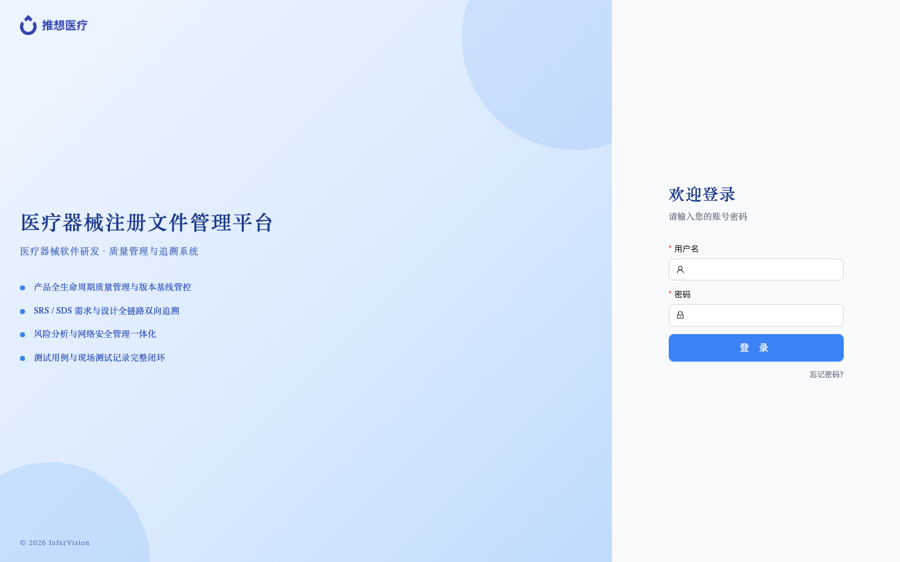

**支持功能**

- 输入用户名、密码后点击「登录」进入系统
- 账号或密码留空会提示请输入用户名 / 密码
- 账号不存在或密码错误：统一提示「用户不存在！」
- 「忘记密码？」：提示联系管理员重置
- 右上角用户名 → **修改密码**（原密码 / 新密码 / 确认新密码）
- 右上角用户名 → **退出登录**

登录成功后进入主界面：左侧为功能菜单，右上角为当前账号，右下角蓝色按钮为 **AI 客服**。左侧第一项「仪表盘」目前只是空白首页，**业务功能尚未实现**，请从其它菜单进入实际模块。

---

## 2. 通用操作约定

**模块概述**：各列表页的查询、新增、编辑、复制、导出、删除用法基本一致。下面约定适用于后续所有模块，避免每页重复说明。
多数列表页操作方式相同：

| 操作 | 说明 |
|------|------|
| 筛选 / 搜索 | 选产品、版本或输入关键词后点放大镜 |
| 新增 | 右上角蓝色「新增」，弹窗或进入编辑页 |
| 查看 / 编辑 | 行内操作，进入详情或弹窗 |
| 复制 | 按当前文档生成新版本 |
| 导出 | 导出 Word 或 Excel |
| 删除 | 行内删除，需确认；被引用数据通常会拦截 |
| 批量删除 | 先勾选行，再点右上角「批量删除」 |
| 分页 | 列表右下角切换页码与每页条数 |

**文档类模块（立项报告、SRS、SDS、测试计划等）共性能力**

- 按「产品 + 文档版本」管理
- 新建后进入章节树编辑（初始化模板、保存）
- 支持查看、编辑、复制、导出 Word、删除
- 文件编号常从产品 DHF 自动带出
- 同一产品同一文档版本不可重复

无权限的菜单不显示；无权限操作会提示「您没有权限执行此操作」。

系统预置角色：超级管理员、DQA、QA、RA、产品经理、开发人员、测试人员。产品经理通常只能看自己创建或被分配的产品。

---

## 3. 系统配置

**模块概述**：本模块管理系统「谁能用、能看哪些菜单、产品挂在哪条产品线下」。一般由管理员先配置角色权限和用户账号，再建产品线；后续所有产品都必须归属某条产品线。

### 3.1 角色管理

**概述**：查看系统预置的 7 个角色，并设置每个角色能进入哪些菜单。固定角色不能改名、不能删除；超级管理员权限全部开放且不可改。

**入口**：系统配置 → 角色管理

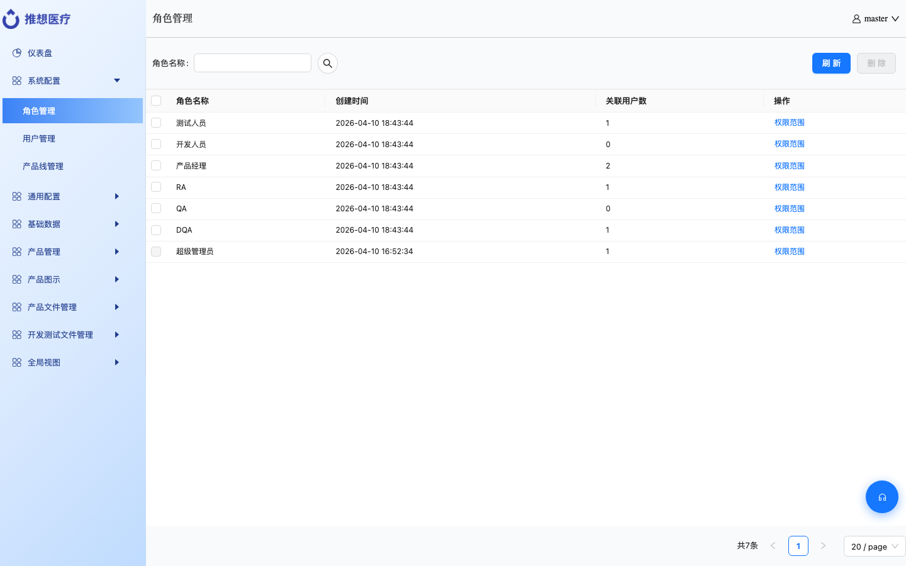

**支持功能**

- 查看预置 7 个固定角色及关联用户数
- 行内「权限范围」：勾选该角色可见的导航模块（root 权限固定不可改）
- 刷新列表
- 自定义角色可删除；固定角色、仍有用户的角色不可删
- 无「新增角色」入口（使用预置角色）

### 3.2 用户管理

**概述**：创建和维护登录账号：分配角色、重置密码、删除用户。新用户使用系统默认初始密码，首次登录后应尽快修改。

**入口**：系统配置 → 用户管理

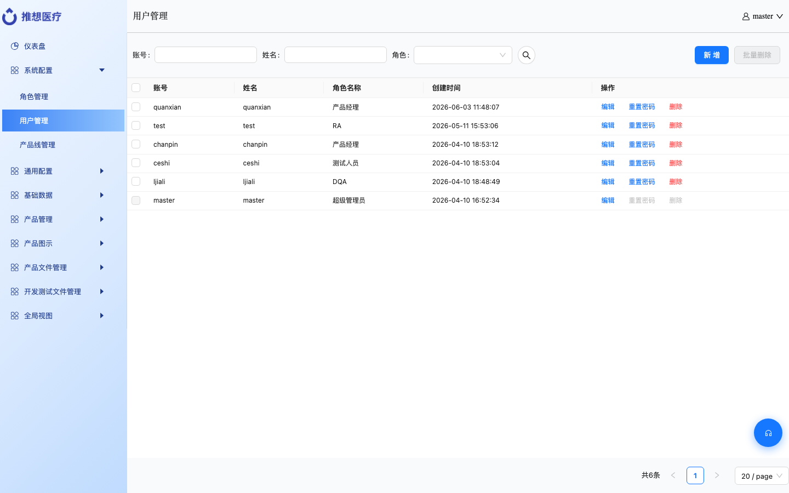

**支持功能**

- 按账号、姓名、角色筛选
- 新增用户（账号、姓名、角色；初始密码为系统默认值）
- 编辑姓名与角色（内置 `master` 角色不可改）
- 重置密码、删除、批量删除
- 不能删除自己；不能删除 / 重置管理员 `master`

### 3.3 产品线管理

**概述**：维护产品的上级分组（产品线/项目），需填写名称和注册国家。产品必须挂在某条产品线下；线下已有产品时不能删除该产品线。

**入口**：系统配置 → 产品线管理

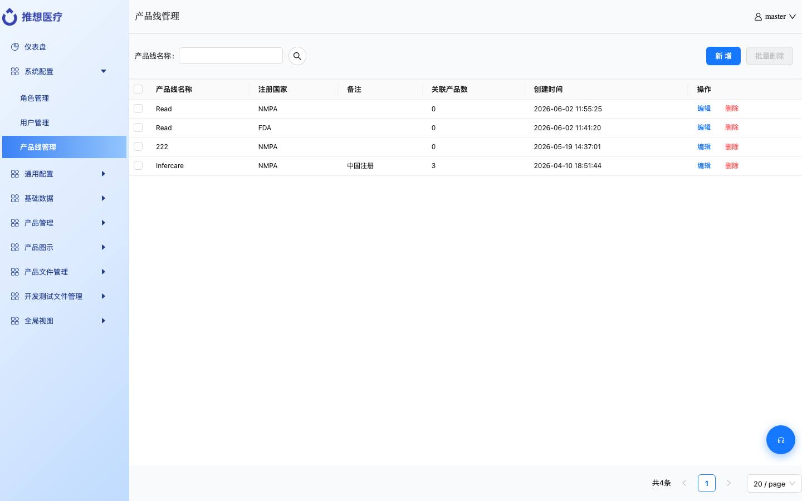

**支持功能**

- 新增 / 编辑产品线（名称、注册国家 FDA/NMPA/PMDA/CE/MDR、备注）
- 删除、批量删除
- 产品线下已有产品时不可删除
- 名称 + 注册国家不可重复

---

## 4. 通用配置

**模块概述**：本模块维护全系统共用的基础资料：公司抬头、人员签字/印鉴、版本号怎么写、打印机怎么连。这些信息会在导出 Word 封面/页眉、插入签名、一键打印时自动取用，只需配置一次。

### 4.1 打印服务配置

**概述**：配置系统连接的打印机（IPP 或 TCP9100），可测试连接并指定一台为默认。全局视图里的「一键打印」会打到这台默认打印机。

**入口**：通用配置 → 打印服务配置

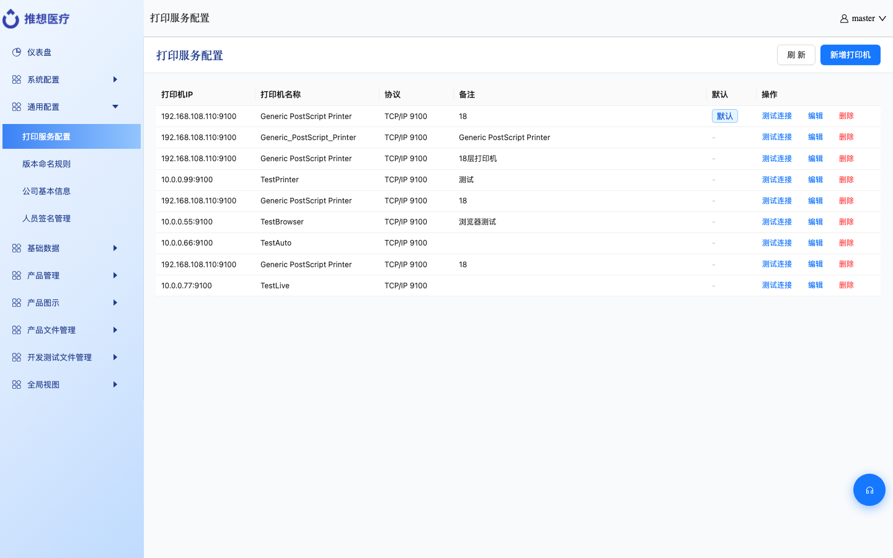

**支持功能**

- 新增 / 编辑打印机（名称、主机、端口、协议 IPP 或 TCP9100）
- 测试连接、设为默认打印机
- 删除打印机
- 一键打印依赖此处的默认打印机

### 4.2 版本命名规则

**概述**：维护全公司共用的版本号书写说明。相关文档（如版本更新历史、产品技术要求）会引用这段文字，点击即可编辑、失焦自动保存。

**入口**：通用配置 → 版本命名规则

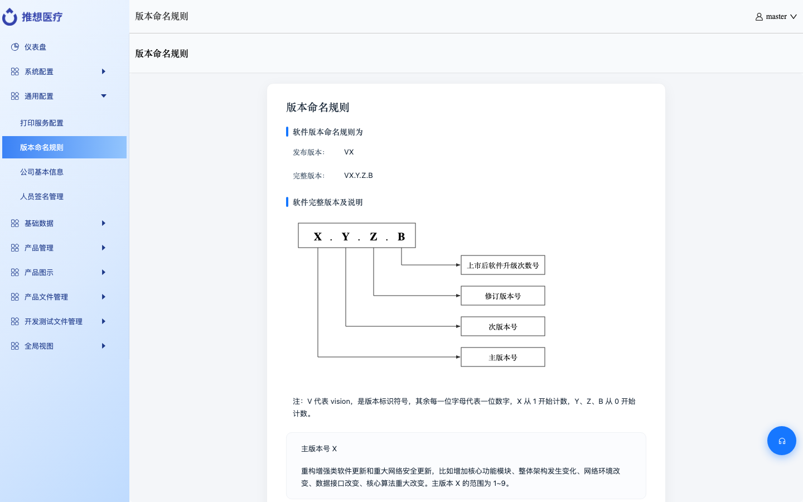

**支持功能**

- 全局仅一条规则，所有产品共用
- 点击文字直接编辑，失焦自动保存
- 下方示意图固定，不可改

### 4.3 公司基本信息

**概述**：维护注册人、住所、生产许可证等公司抬头信息。导出各类 Word 时自动填到封面和页眉，避免每份文档手工抄写。

**入口**：通用配置 → 公司基本信息

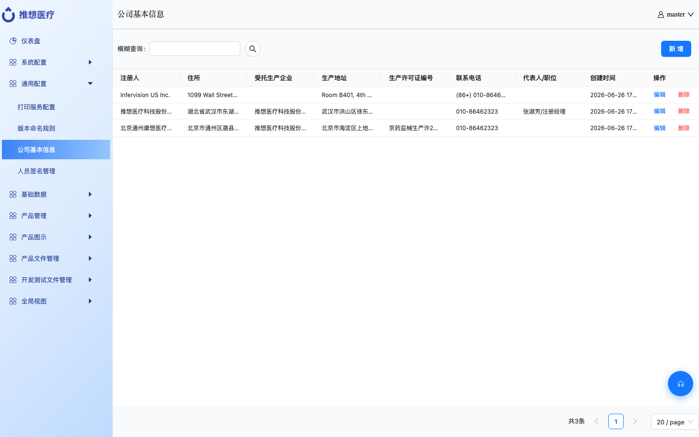

**支持功能**

- 维护注册人、住所、受托生产企业、生产地址、许可证、电话、代表人等
- 新增 / 编辑 / 删除 / 模糊搜索
- 导出文档时自动填充封面、页眉

### 4.4 人员签名管理

**概述**：上传人员的签字图和印鉴图，并设置职务、启用状态和排序。文档导出需要签名/盖章时，系统按这里的图片插入。

**入口**：通用配置 → 人员签名管理

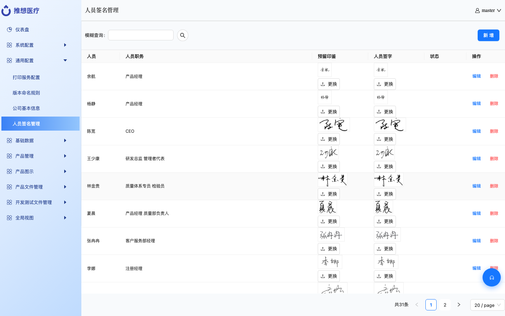

**支持功能**

- 维护姓名、职务、印鉴图、签字图、启用状态、排序
- 上传 png/jpg/jpeg，列表内预览
- 文档导出时按排序注入签名 / 印章

---

## 5. 基础数据

**模块概述**：本模块维护风险相关的全局标准库（危害 HAZ、控制措施 RCM、网络安全威胁 THREAT）。库是公司级的，各产品做风险评估时从这里勾选引用，不必每个产品重新录入一遍。

### 5.1 HAZ 管理（危害分析库）

**概述**：维护危害分析标准库：危害来源、事件、处境、损害，以及初始/剩余风险和关联的控制措施。产品做 HAZ 分析时从本库勾选。

**入口**：基础数据 → HAZ管理

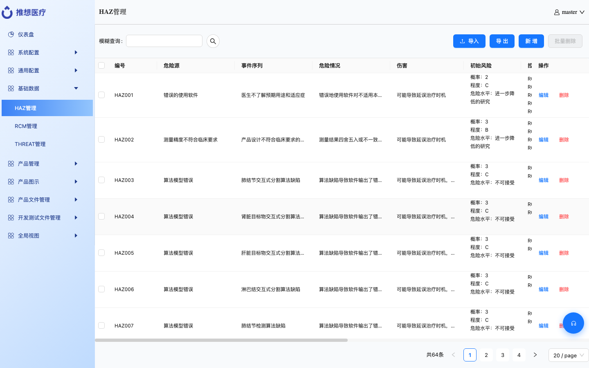

**支持功能**

- 维护危害来源、事件、处境、损害及初始/剩余风险评估
- 关联 RCM 控制措施
- 模糊搜索、导入 Excel、导出、新增、编辑、删除、批量删除

### 5.2 RCM 管理（风险控制措施库）

**概述**：维护可复用的风险控制措施（编号、描述、证明）。可被危害分析、需求规格说明中的需求条目、产品 RCM 引用。

**入口**：基础数据 → RCM管理

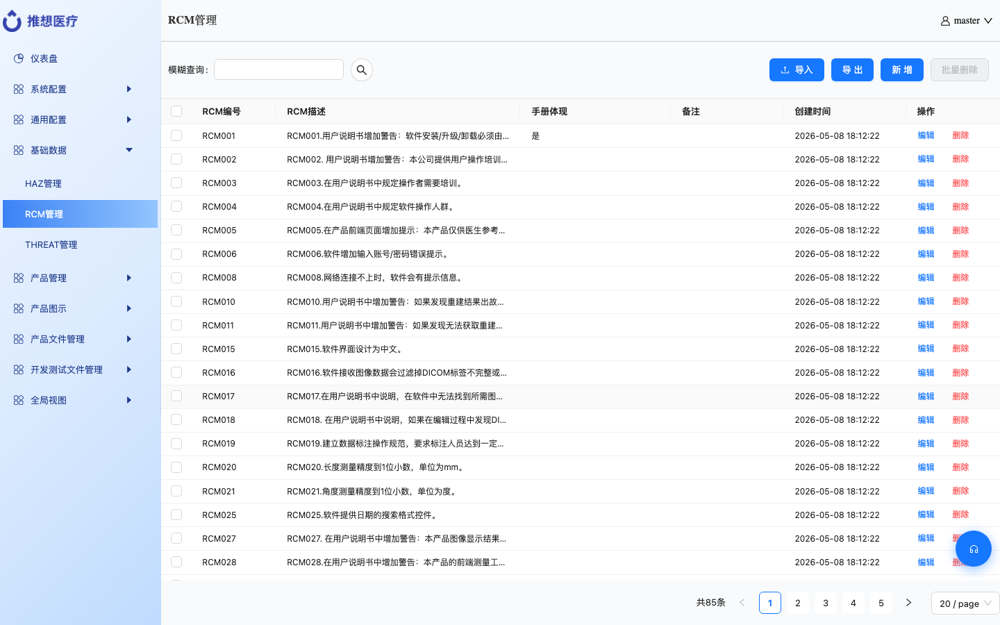

**支持功能**

- 维护控制措施编号、描述、证明、备注
- 被 HAZ、SRS 需求、产品 RCM 引用
- 搜索、导入、导出、新增、编辑、删除、批量删除
- 编号不可重复

### 5.3 THREAT 管理（网络安全威胁库）

**概述**：维护网络安全威胁标准库（类别、模块、连接、描述、损害），供产品网络安全风险评估引用。

**入口**：基础数据 → THREAT管理

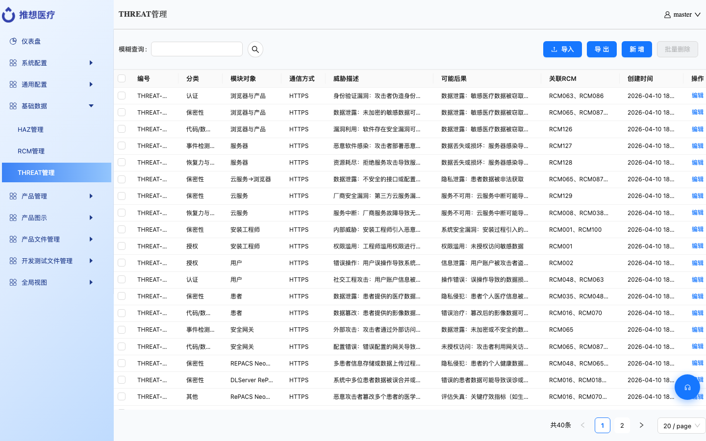

**支持功能**

- 维护威胁编号、类别、模块、连接、描述、损害
- 类别含认证、授权、保密性等（IEC 62443 风格）
- 搜索、导入、导出、新增、编辑、删除

---

## 6. 产品管理

**模块概述**：本模块建立具体的产品版本，并维护该版本的人员、时间计划、运行环境、设备、DHF 清单，以及本产品要分析的危害/控制措施/威胁。系统里几乎所有文档、图示、测试都挂在某个产品版本下，因此通常先在这里建好产品，再去写文件。

### 6.1 版本管理

**概述**：新建、编辑、复制、删除具体产品版本。名称+完整版本必须唯一。复制时可勾选 DHF 条目，把对应模块文档一并带到新版本；未勾选则只复制产品主数据。

**入口**：产品管理 → 基本信息 → 版本管理

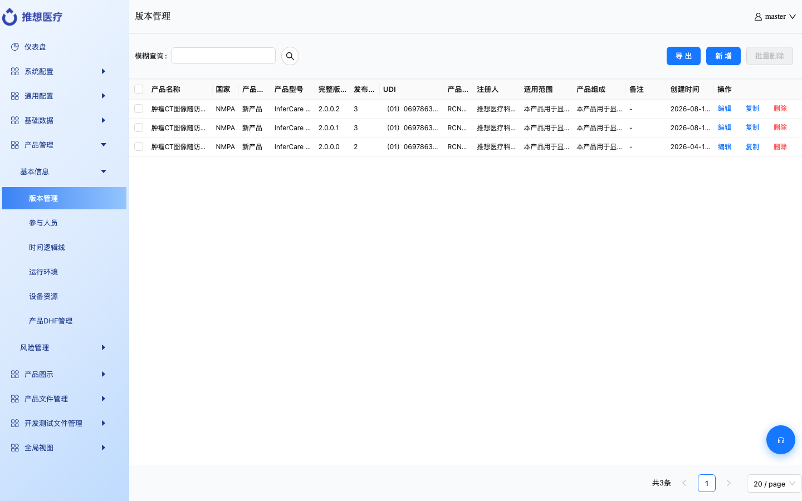

**支持功能**

- 新增产品：名称、所属产品线、类别、型号、完整版本、发布版本、UDI、适用范围、组成等
- 名称 + 完整版本必须唯一
- 编辑、复制（可勾选 DHF，联动复制对应模块文档，如需求规格说明、软件详细设计）
- 导出 Excel、删除、批量删除
- 存在 SRS / 测试集 / DHF / 图表时禁止删除产品
- 模糊查询

复制时请勾选需要带走的 DHF 条目（例如「需求规格说明」）。未勾选则只复制产品主数据。

### 6.2 参与人员

**概述**：按「职能 → 姓名」维护该产品的项目成员。各文档的编制、审核人通常从这里自动带出。使用前必须先选择产品。

**入口**：产品管理 → 基本信息 → 参与人员

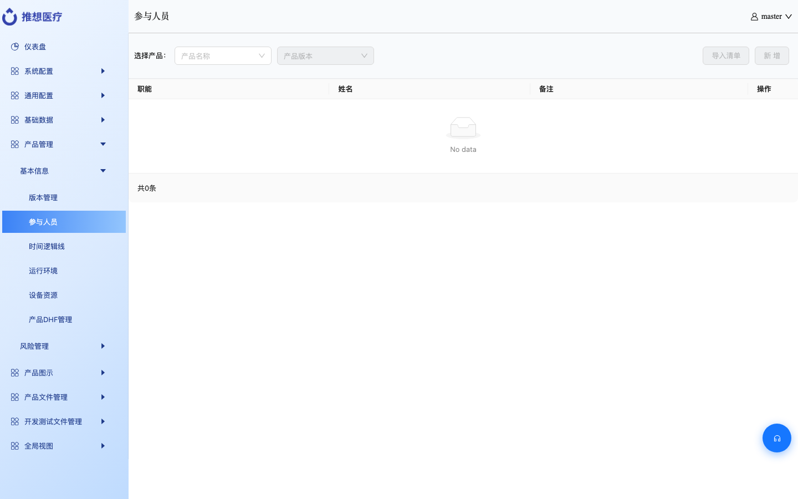

**支持功能**

- 先选择产品（未选时列表为空）
- 按「职能 → 姓名」维护产品成员，一人一行
- 新增、导入清单、单元格失焦保存、删除
- 供各文档自动带出编制 / 审核人员

### 6.3 时间逻辑线

**概述**：按产品维护各部门关键时间节点（时间×部门矩阵）。开发/测试环境周检查表、代码审查日期等会按这里的区间自动生成。

**入口**：产品管理 → 基本信息 → 时间逻辑线

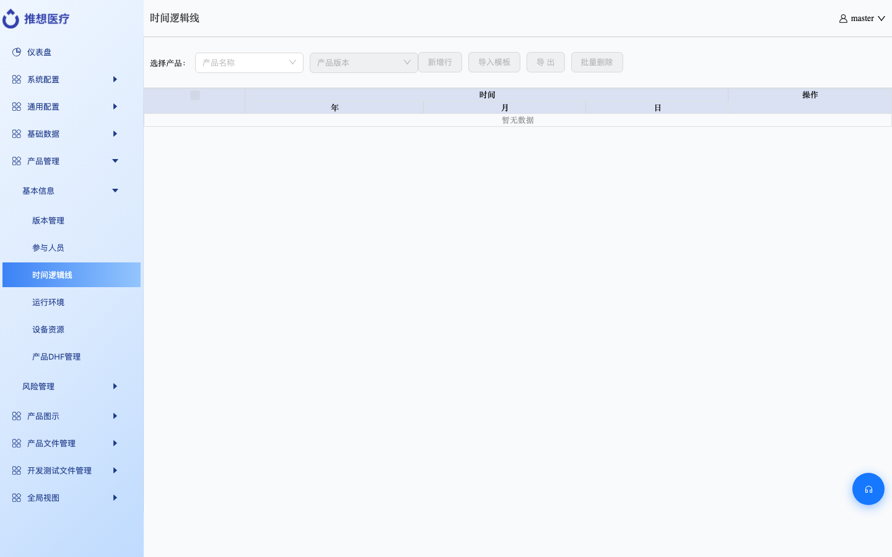

**支持功能**

- 按产品维护「时间 × 部门」矩阵
- Excel 导入 / 导出
- 供开发/测试环境周检查表、代码审查日期等自动取数

### 6.4 运行环境

**概述**：维护产品《运行环境》相关表格，供需求规格说明、产品技术要求等章节自动获取，避免多处不一致。

**入口**：产品管理 → 基本信息 → 运行环境

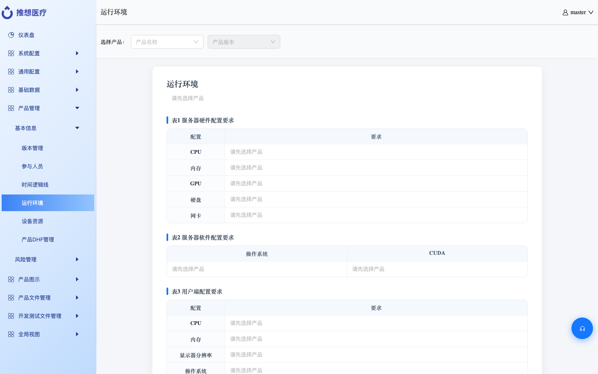

**支持功能**

- 维护《2.4 运行环境》多张表（模板预填）
- 失焦实时保存
- 供 SRS / 产品技术要求等章节自动获取

### 6.5 设备资源

**概述**：维护产品相关设备的用途、名称和数量，供后续文档自动带出设备信息。

**入口**：产品管理 → 基本信息 → 设备资源

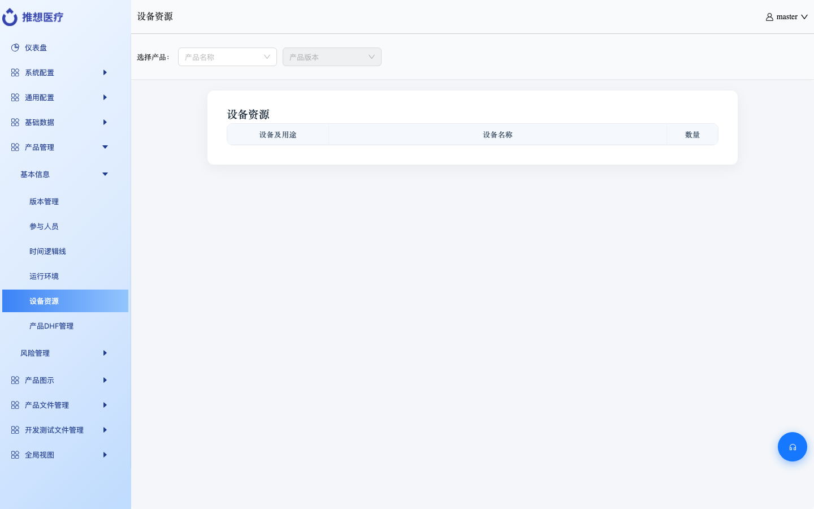

**支持功能**

- 维护设备及用途、名称、数量
- 模板预填、失焦保存
- 供相关文档自动带出

### 6.6 产品 DHF 管理

**概述**：维护本产品的设计历史文件（DHF）清单，即文件编号和文件名称。各模块文档的文件编号常从此同步；版本复制时也按勾选的 DHF 决定复制哪些文档。

**入口**：产品管理 → 基本信息 → 产品DHF管理

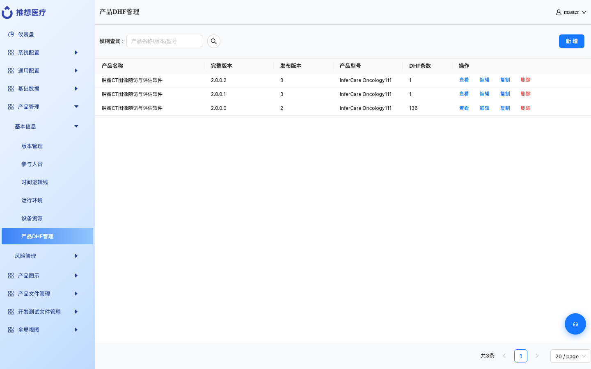

**支持功能**

- 维护设计历史文件清单（文件编号 + 文件名称）
- 新增、编辑、删除、导入、导出
- 各模块文档的文件编号常从此处同步
- 版本复制时可按勾选的 DHF 联动复制文档

### 6.7 风险参与人员

**概述**：维护风险管理报告使用的项目角色与姓名（与产品参与人员相互独立）。风险报告里的参与人员章节会从这里选取。

**入口**：产品管理 → 风险管理 → 风险参与人员

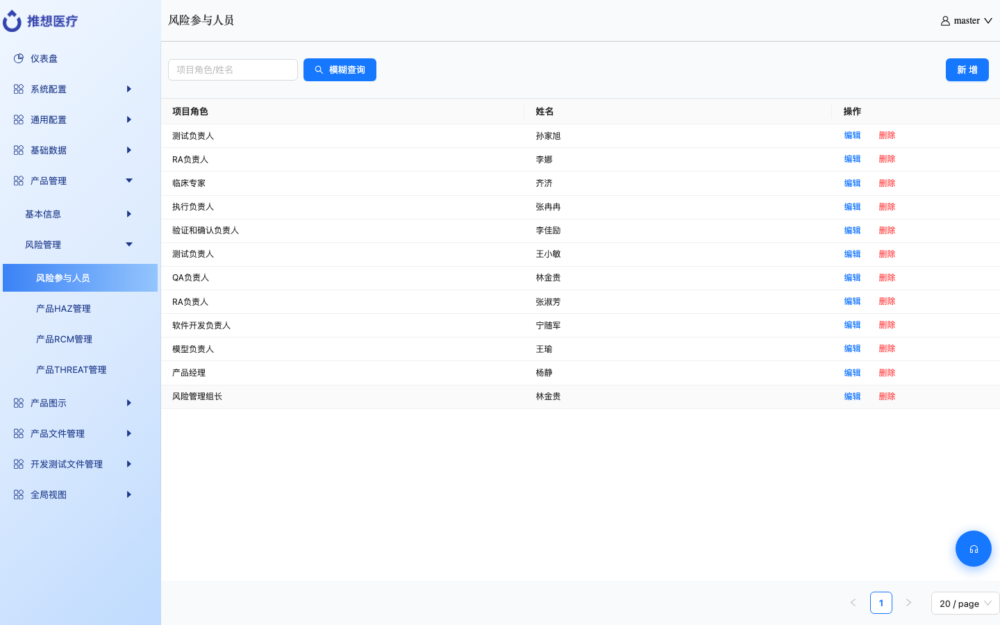

**支持功能**

- 维护风险报告用的项目角色与姓名
- 新增、编辑、删除、搜索
- 角色 + 姓名不可重复

### 6.8 产品 HAZ 管理

**概述**：把基础库中的危害关联到当前产品，并补充产品侧评估。风险管理报告中的风险矩阵以本页数据为准。

**入口**：产品管理 → 风险管理 → 产品HAZ管理

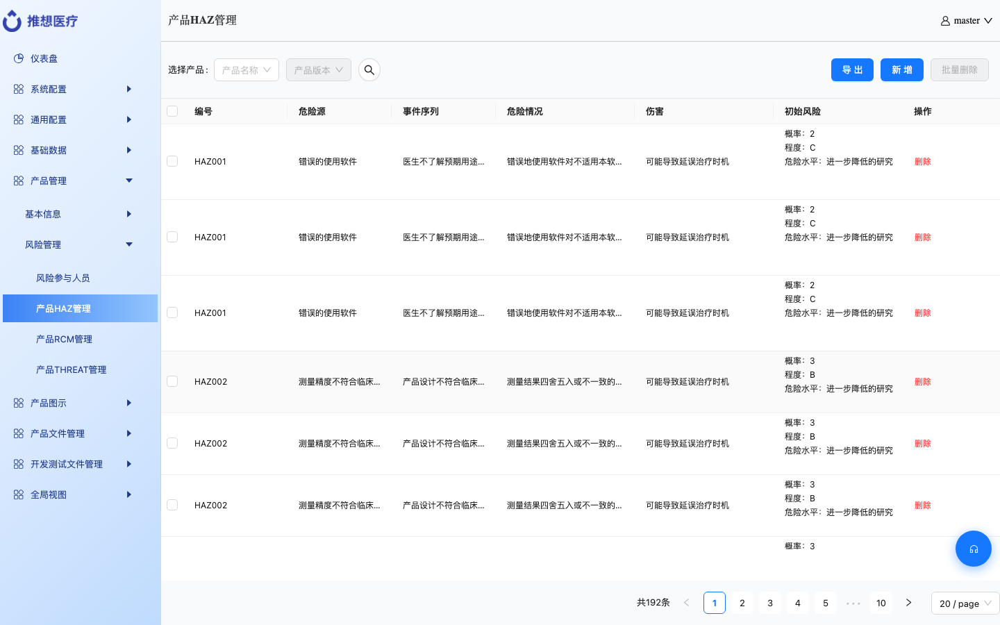

**支持功能**

- 先选产品，从基础库勾选危害加入本产品
- 补充产品侧评估，形成风险矩阵数据源
- 删除、批量删除、导出
- 风险管理报告中的矩阵以本页数据为准

### 6.9 产品 RCM 管理

**概述**：把基础库中的控制措施关联到当前产品，并可查看是否已追溯到 SRS 需求和测试。

**入口**：产品管理 → 风险管理 → 产品RCM管理

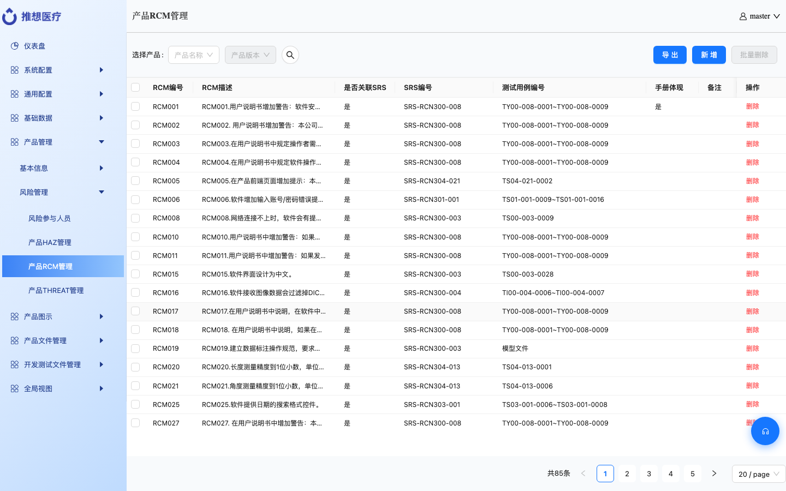

**支持功能**

- 先选产品，从 RCM 库勾选控制措施
- 查看是否已关联 SRS、测试编号
- 删除、批量删除、导出

### 6.10 产品 THREAT 管理

**概述**：把基础库中的网络安全威胁关联到当前产品，供网络安全风险管理计划和报告引用。

**入口**：产品管理 → 风险管理 → 产品THREAT管理

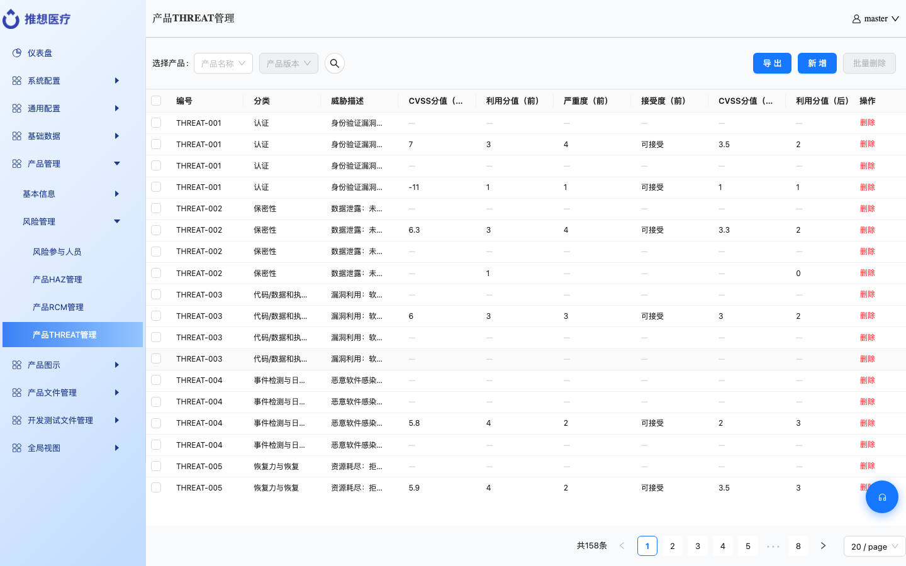

**支持功能**

- 先选产品，从威胁库勾选本产品威胁
- 删除、批量删除、导出
- 供网络安全风险管理引用

---

## 7. 产品图示

**模块概述**：本模块按产品上传和管理结构类、界面类、流程类图片（png/jpg/jpeg），可与需求规格说明、软件详细设计中的配图章节联动。同一套上传/替换/下载/删除操作，只是图的类型不同。
| 菜单 | 用途 | 版本来源 |
|------|------|----------|
| 物理拓扑图 | SRS 物理拓扑 | 需求规格说明版本 |
| 体系结构图 | SRS 系统结构 | 需求规格说明版本 |
| 用户界面关系图 | 界面关系 | 需求规格说明版本 |
| 网络安全流程图 | 网络安全流程 | 详细设计版本 |
| 主页面图示 | 主界面示意 | 按页面规则 |

### 7.1 物理拓扑图

**概述**：上传并管理产品物理拓扑图，一般对应需求规格说明中的拓扑章节，可与文档配图联动。

**入口**：产品图示 → 物理拓扑图

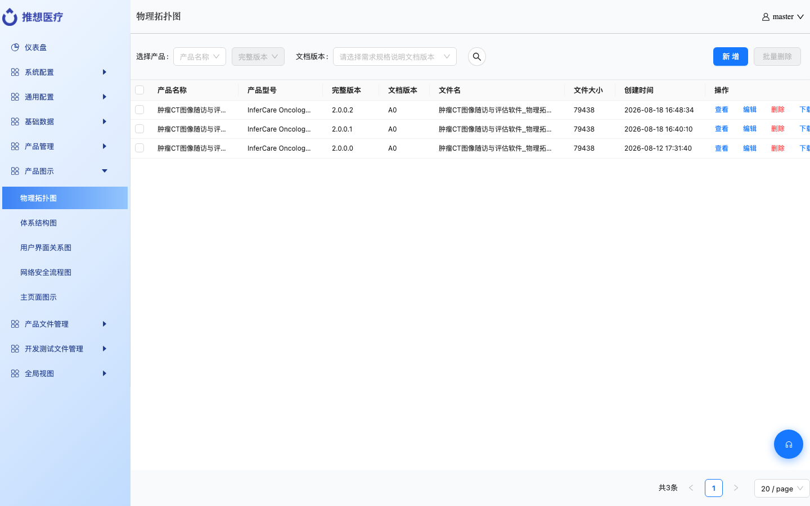

### 7.2 体系结构图

**概述**：上传并管理产品体系结构/系统结构图，一般对应需求规格说明中的系统结构图章节。

**入口**：产品图示 → 体系结构图

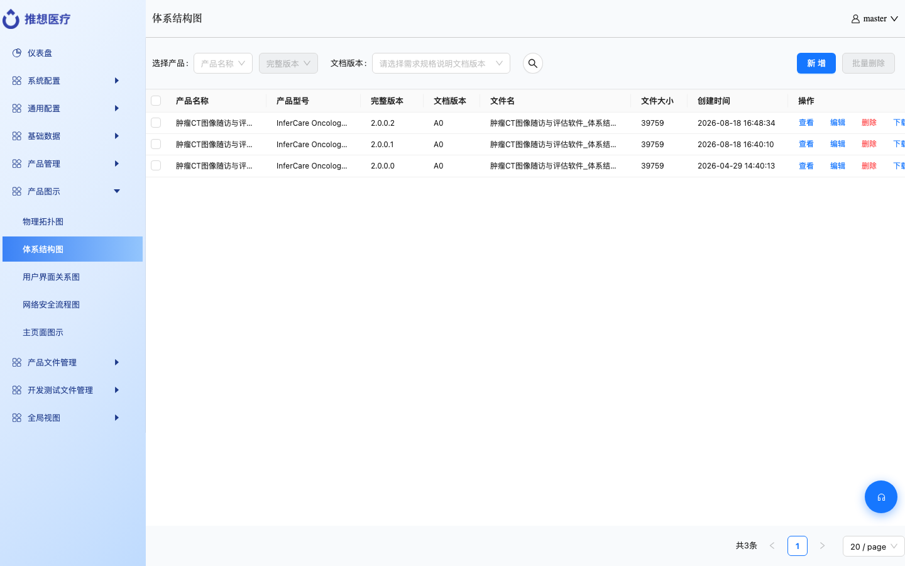

### 7.3 用户界面关系图

**概述**：上传并管理用户界面之间的关系示意图。

**入口**：产品图示 → 用户界面关系图

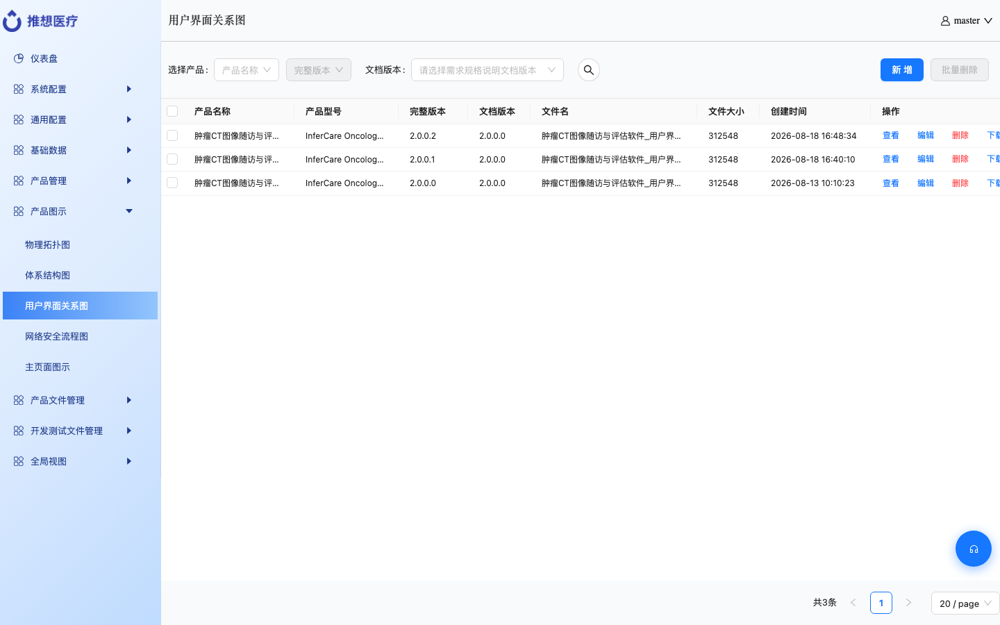

### 7.4 网络安全流程图

**概述**：上传并管理网络安全相关流程图，版本通常对应软件详细设计。

**入口**：产品图示 → 网络安全流程图

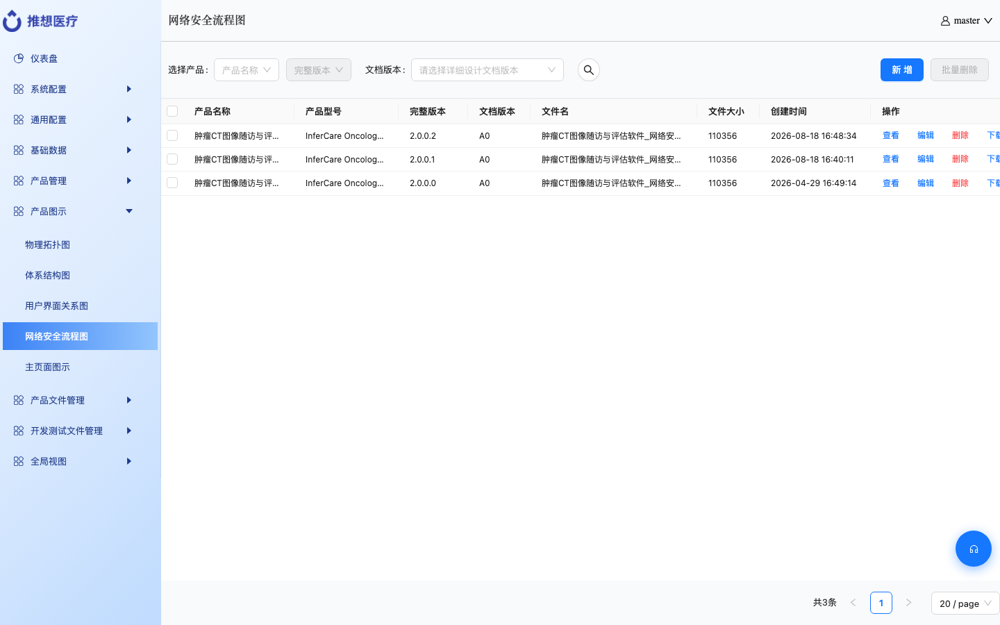

### 7.5 主页面图示

**概述**：上传并管理产品主界面示意图，供相关文档附录或界面说明使用。

**入口**：产品图示 → 主页面图示

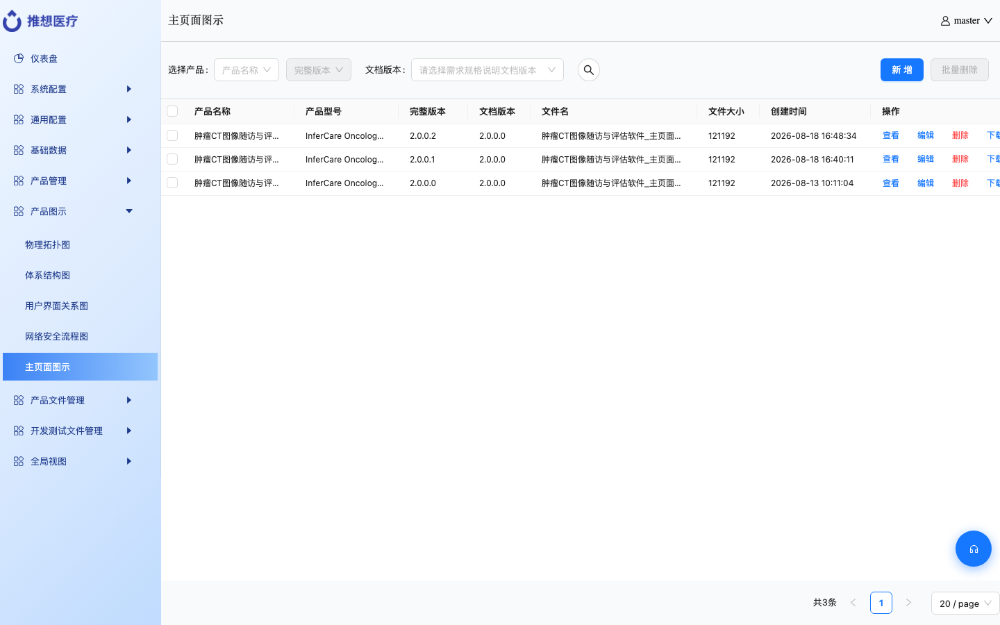

**以上图示共同支持**

- 按产品、文档版本筛选
- 新建上传、编辑替换、下载、删除、批量删除
- 与 SRS / SDS 对应章节图片联动（无图节点不覆盖已手工上传的图）

---

## 8. 产品文件管理

**模块概述**：本模块编写注册申报常用的产品文件和风险文件，例如立项报告、需求规格说明、验收记录、风险管理报告等。文档按「产品 + 文档版本」管理，支持章节树编辑、复制新版本、导出 Word。

### 8.1 产品立项报告

**概述**：编写产品立项阶段的报告，说明为何立项、产品基本信息等。基本信息表和修订记录可按产品、时间线、参与人员自动带出。

**入口**：产品文件管理 → 产品文件 → 产品立项报告

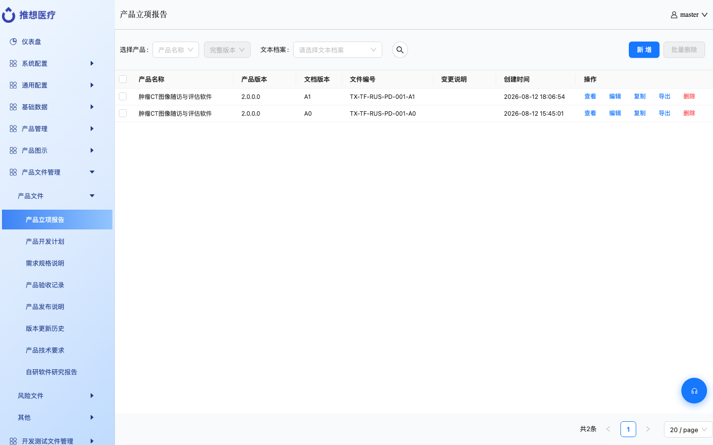

**支持功能**：新增、查看、编辑章节树、复制、导出 Word、删除。基本信息表与修订记录可按产品 / 时间线 / 参与人员自动获取。

### 8.2 产品开发计划

**概述**：编写产品开发计划，用章节树维护各阶段安排，模板带默认内容，整份文档保存后可导出 Word。

**入口**：产品文件管理 → 产品文件 → 产品开发计划

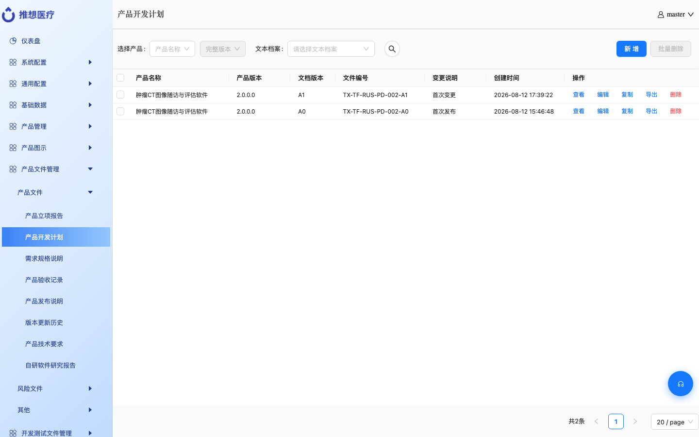

**支持功能**：新增、编辑、复制、导出 Word、删除。模板默认值预填，整份文档 JSON 保存。

### 8.3 需求规格说明（SRS）

**概述**：编写或导入产品需求规格说明，是后续详细设计、测试用例和风险控制追溯的源头。支持 Word 导入、目录树编辑、需求条目/变更表/功能描述维护，以及导出 Word。

**入口**：产品文件管理 → 产品文件 → 需求规格说明

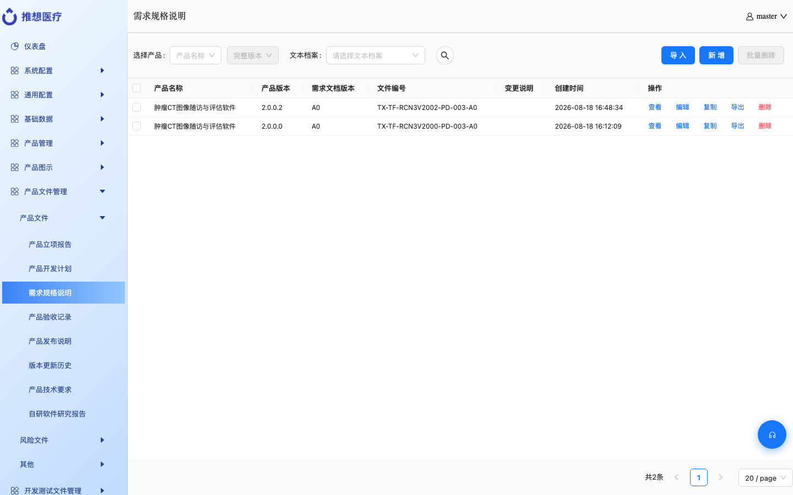

**支持功能**

- 按产品、产品版本、文档版本筛选
- **导入 Word** 解析章节树、需求条目、变更需求表、功能描述
- **新增**：选产品、填需求文档版本 → 初始化模板 → 编辑目录树后保存
- 行内：查看、编辑、复制、导出 Word、删除
- 单击文件编号可直接改编号并保存
- 编辑页维护：章节树、标准/其他需求表、变更需求表、第 7 章功能描述、RCM 绑定、结构图等
- 删除 SRS 会清空需求列表，并解除已绑定 SDS（软删）

### 8.4 产品验收记录

**概述**：记录产品验收过程和结论。产品信息自动获取，部分章节只读，避免与产品档案不一致。

**入口**：产品文件管理 → 产品文件 → 产品验收记录

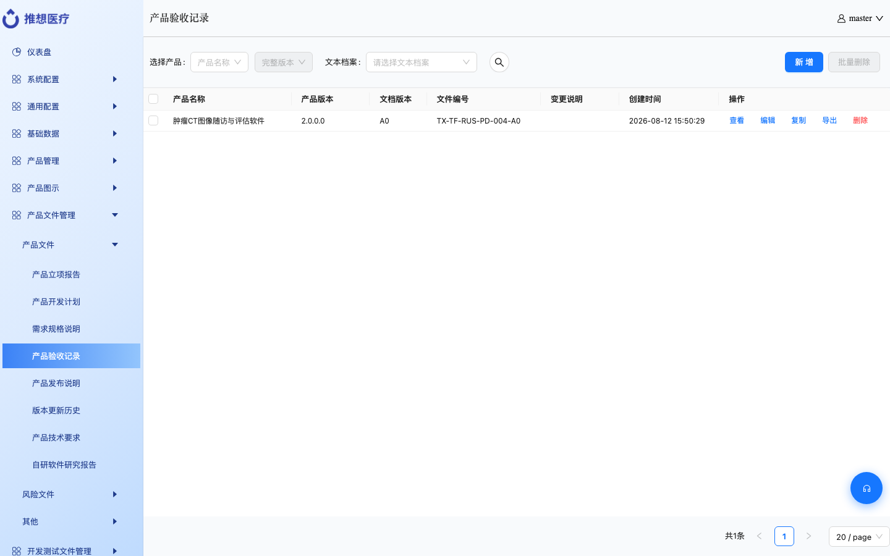

**支持功能**：新增、编辑章节树、复制、导出 Word、删除。产品信息自动获取（只读章节不可改）。

### 8.5 产品发布说明

**概述**：编写对外或对内的产品发布说明，按文档版本管理，可复制后改下一版。

**入口**：产品文件管理 → 产品文件 → 产品发布说明

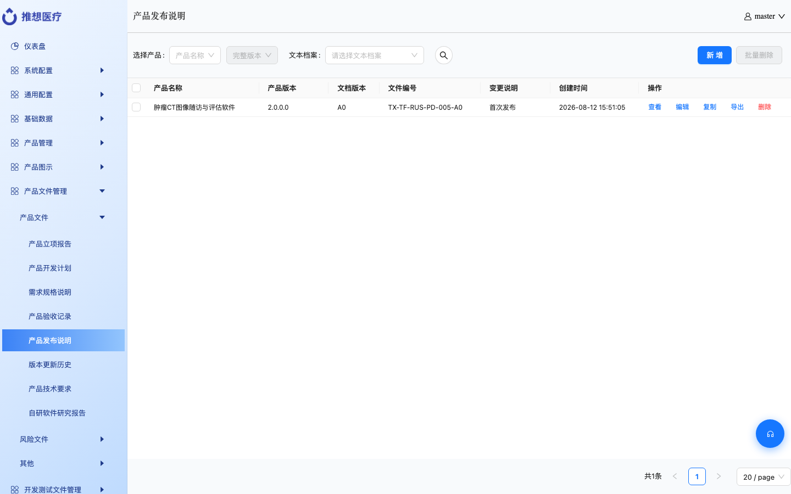

**支持功能**：新增、编辑、复制、导出 Word、删除。

### 8.6 版本更新历史

**概述**：记录产品各版本更新内容。版本信息取该产品最新版本，命名规则取通用配置，更新历史表和修订记录会预留空行。

**入口**：产品文件管理 → 产品文件 → 版本更新历史


**支持功能**：新增、编辑、复制、导出 Word、删除。版本信息取产品最新版本；命名规则取全局配置；更新历史表 / 修订记录自动填空。

### 8.7 产品技术要求

**概述**：编写产品技术要求。版本、命名规则、运行环境可自动获取，附录可嵌入体系结构图和物理拓扑图。

**入口**：产品文件管理 → 产品文件 → 产品技术要求

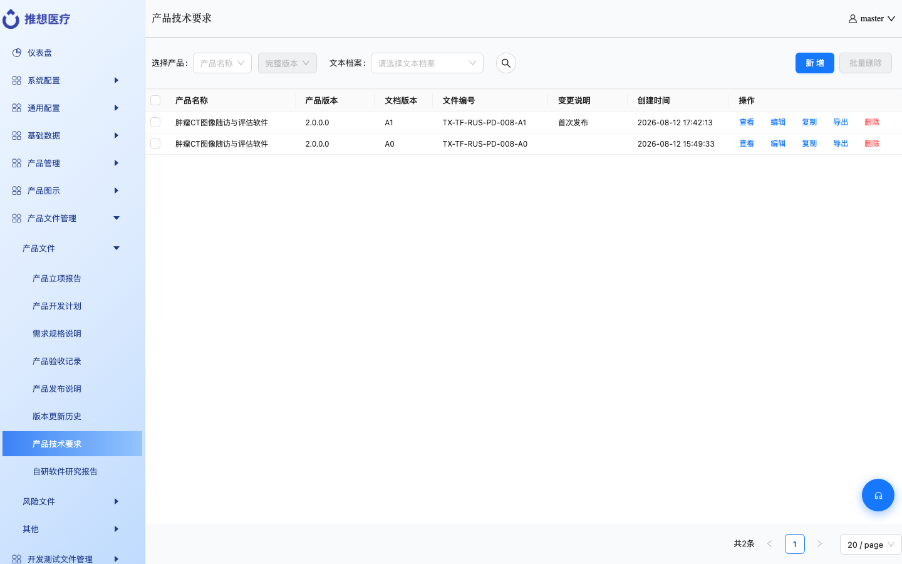

**支持功能**：新增、编辑、复制、导出 Word、删除。版本、命名规则、运行环境可自动获取；附录可嵌入体系结构图与物理拓扑图。

### 8.8 自研软件研究报告

**概述**：编写自研软件相关研究说明，部分章节可自动获取产品信息。

**入口**：产品文件管理 → 产品文件 → 自研软件研究报告

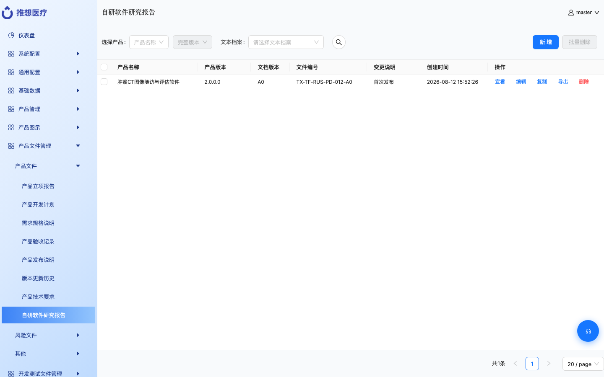

**支持功能**：新增、编辑、复制、导出 Word、删除。部分章节自动获取。

### 8.9 风险管理计划

**概述**：编写本产品如何开展风险管理的计划类文档，产品信息自动获取，导出 Word。

**入口**：产品文件管理 → 风险文件 → 风险管理计划

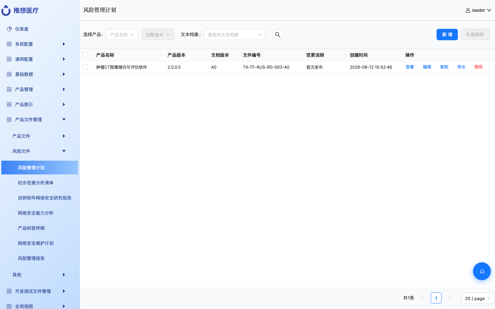

**支持功能**：新增、编辑章节树、复制、导出 Word、删除。产品信息自动获取。

### 8.10 初步危害分析清单（PHA）

**概述**：维护初步危害分析清单，含 CFMEA/DFMEA/PFMEA 等表格，可从产品 HAZ 回填后继续编辑。

**入口**：产品文件管理 → 风险文件 → 初步危害分析清单

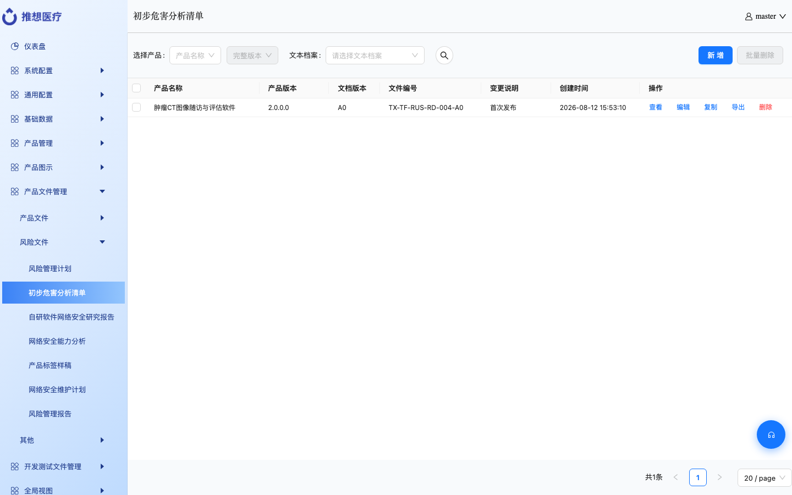

**支持功能**：新增、编辑 CFMEA/DFMEA/PFMEA 表、从产品 HAZ 回填、复制、导出 Word、删除。

### 8.11 自研软件网络安全研究报告

**概述**：编写自研软件在网络安全方面的研究报告，部分内容自动获取。

**入口**：产品文件管理 → 风险文件 → 自研软件网络安全研究报告

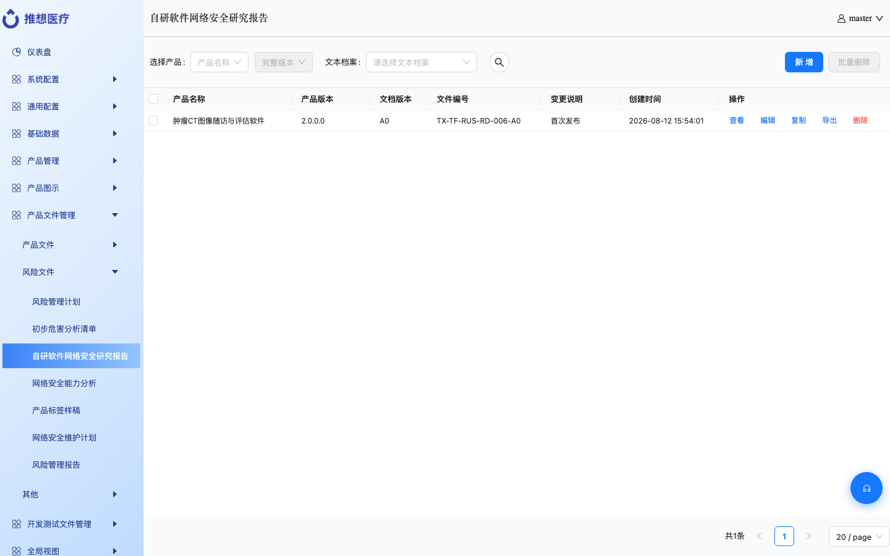

**支持功能**：新增、编辑、复制、导出 Word、删除。部分内容自动获取。

### 8.12 网络安全能力分析

**概述**：按 MDS2 能力项以网格方式评估产品网络安全能力，结果可导出 Excel。

**入口**：产品文件管理 → 风险文件 → 网络安全能力分析

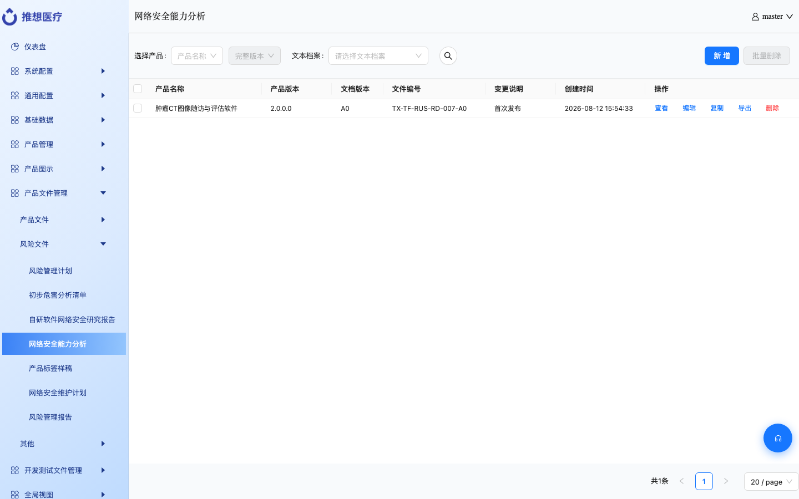

**支持功能**：新增、网格编辑 MDS2 能力项、复制、导出 Excel、删除。

### 8.13 产品标签样稿

**概述**：维护产品标签样稿文档，用于标签内容的编制和导出。

**入口**：产品文件管理 → 风险文件 → 产品标签样稿

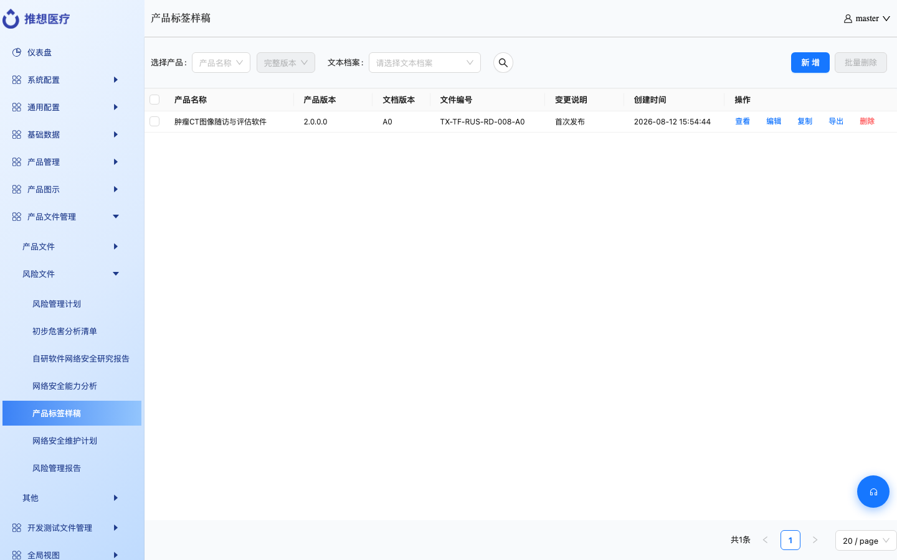

**支持功能**：新增、编辑章节树、复制、导出 Word、删除。

### 8.14 网络安全维护计划

**概述**：编写产品上市后网络安全如何维护的计划类文档。

**入口**：产品文件管理 → 风险文件 → 网络安全维护计划

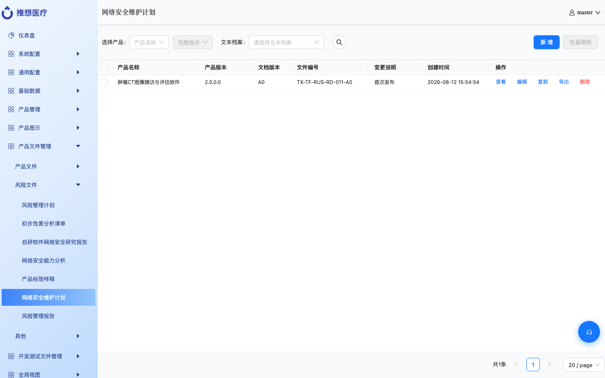

**支持功能**：新增、编辑、复制、导出 Word、删除。部分内容自动获取。

### 8.15 风险管理报告

**概述**：输出本产品风险管理的结论性报告，含参与人员、接受标准、风险分析矩阵和控制措施。矩阵数据主要来自「产品 HAZ」。

**入口**：产品文件管理 → 风险文件 → 风险管理报告

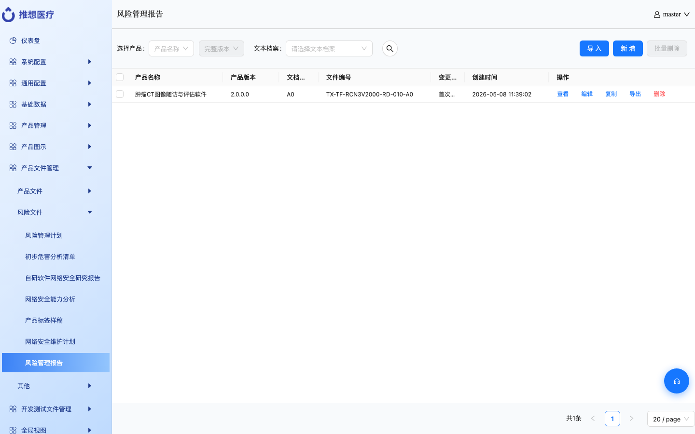

**支持功能**

- 新增 / 导入 Word / 复制版本 / 导出 Word / 删除
- 编辑页：初始化模板、参与人员、接受标准矩阵、风险分析矩阵、风险控制措施
- 风险矩阵主要取自「产品 HAZ」实时数据

### 8.16 培训记录表

**概述**：登记与本产品相关的培训记录，以大表格方式维护，可导出 Word。

**入口**：产品文件管理 → 其他 → 培训记录表

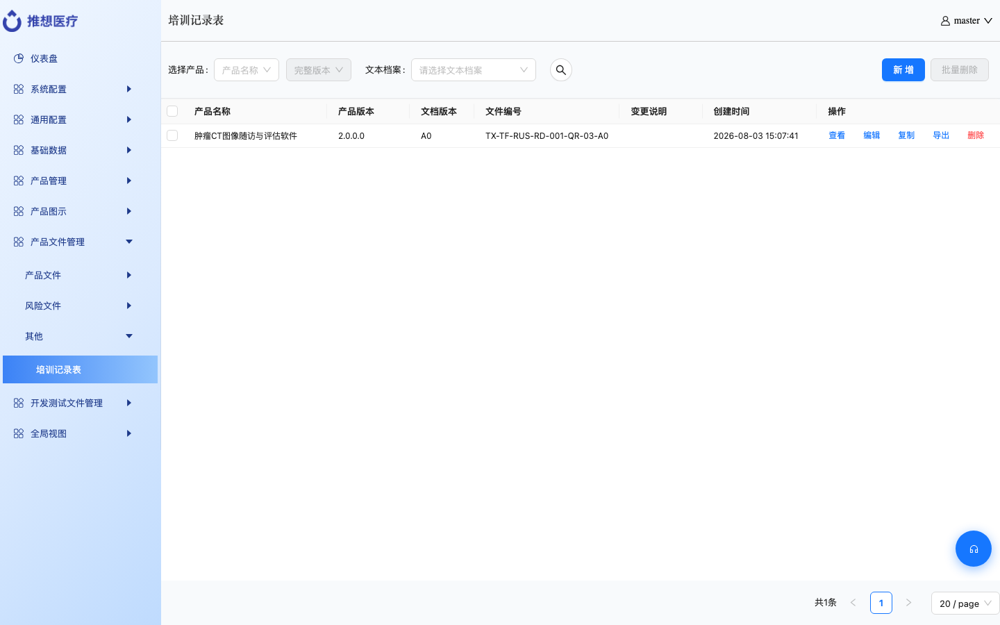

**支持功能**：新增、大表格编辑培训记录、复制、导出 Word、删除。

---

## 9. 开发测试文件管理

**模块概述**：本模块覆盖软件开发过程文件、测试过程文件、网络安全风险管理，以及需求到设计/测试的追溯分析。开发文件含详细设计（须先有 SRS），测试文件含测试计划、用例合集、缺陷与现场记录等。

### 9.1 开发文件

**概述**：集中管理软件开发过程产生的计划、设计、环境和审查类文档。其中软件详细设计必须绑定已有的需求规格说明版本。

以下模块均为「产品 + 文档版本」列表，共性操作为：筛选、新增、查看、编辑、复制、导出 Word、删除。

#### 软件配置管理计划

**概述**：规定本产品软件配置项如何标识、控制和基线管理，章节树编辑后导出 Word。

**入口**：开发测试文件管理 → 开发文件 → 软件配置管理计划

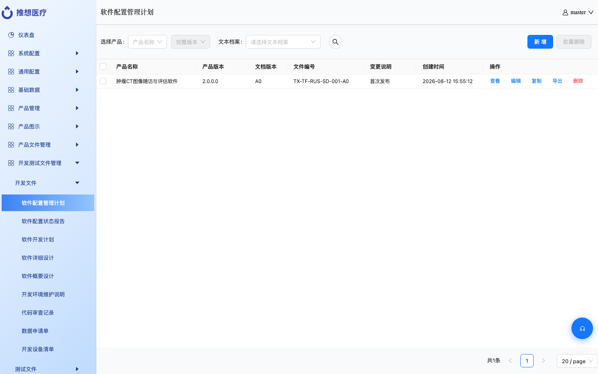

章节树编辑，导出 Word。

#### 软件配置状态报告

**概述**：记录当前配置项状态，用于配置审计和状态说明。

**入口**：开发测试文件管理 → 开发文件 → 软件配置状态报告


章节树编辑，导出 Word。

#### 软件开发计划

**概述**：安排软件开发人员、资源和里程碑，文档内含人员表、资源表、里程碑表。

**入口**：开发测试文件管理 → 开发文件 → 软件开发计划

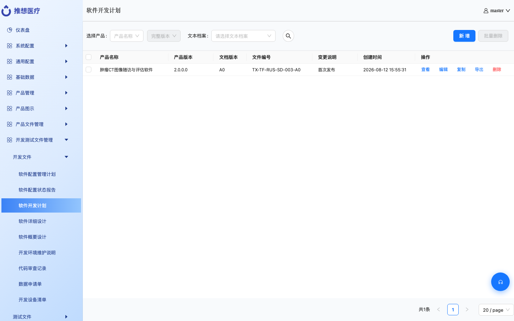

含人员表、软件资源表、里程碑表，导出 Word。

#### 软件详细设计（SDS）

**概述**：在需求规格说明基础上编写软件详细设计。新建时必须选择已有 SRS 版本，可导入 Word，并与需求做追溯同步。

**入口**：开发测试文件管理 → 开发文件 → 软件详细设计

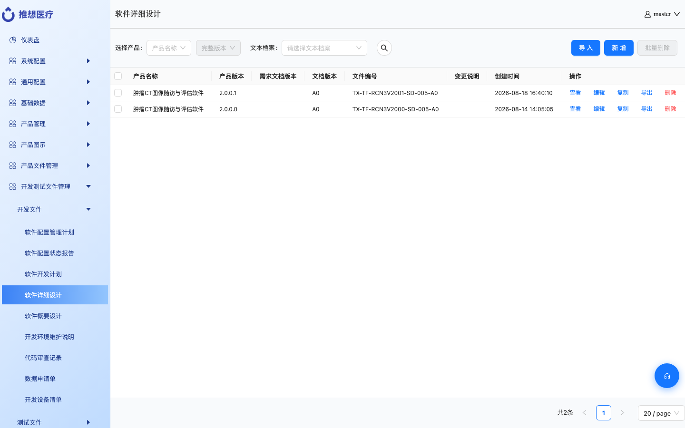

**支持功能**

- 按产品、版本筛选；**导入 Word**；新增（须绑定已有 SRS 版本）
- 查看、编辑、复制、导出 Word、删除
- 文件编号可单击修改
- 编辑页：初始化模板、设计条目、与 SRS 追溯同步、第 6 章功能设计同步

新建 SDS 前请先完成对应产品的需求规格说明。

#### 软件概要设计

**概述**：编写软件概要/高层设计文档，描述总体结构和主要模块划分。

**入口**：开发测试文件管理 → 开发文件 → 软件概要设计

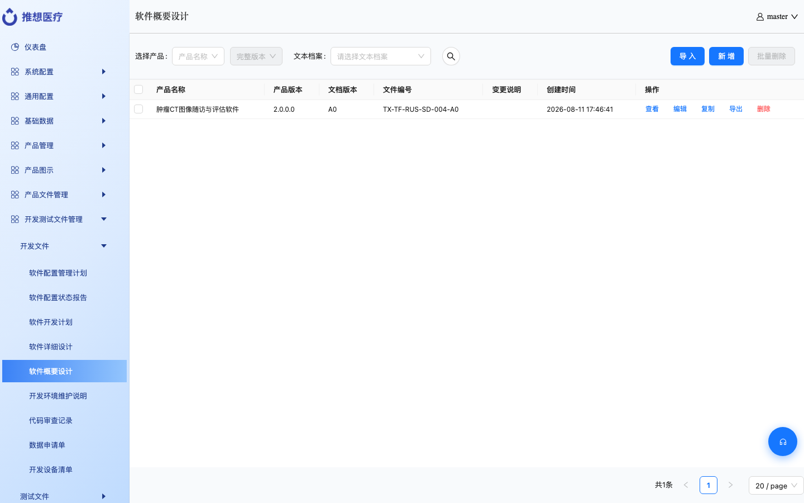

**支持功能**：新增、编辑、复制、导入/导出、删除。用于概要设计文档及结构图等。

#### 开发环境维护说明

**概述**：说明开发环境如何检查和维护。资产编码从开发设备清单带出，周检查表按时间线自动生成行。

**入口**：开发测试文件管理 → 开发文件 → 开发环境维护说明

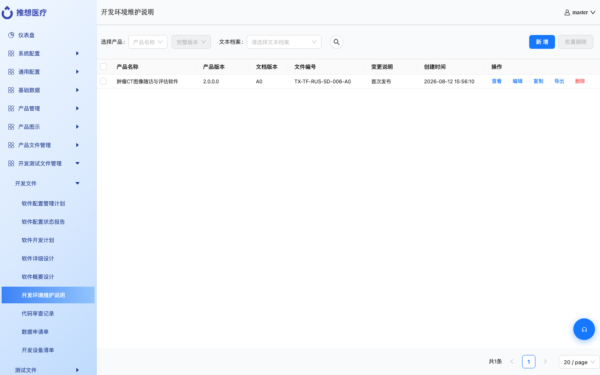

资产编码从开发设备清单带出；周检查表按时间线「开始开发～测试结束」生成；导出横版 Word。

#### 代码审查记录

**概述**：记录代码审查检查项、结论和签字。日期、被审核人、审核人、签名章可从时间线、参与人员和人员签名自动获取。

**入口**：开发测试文件管理 → 开发文件 → 代码审查记录

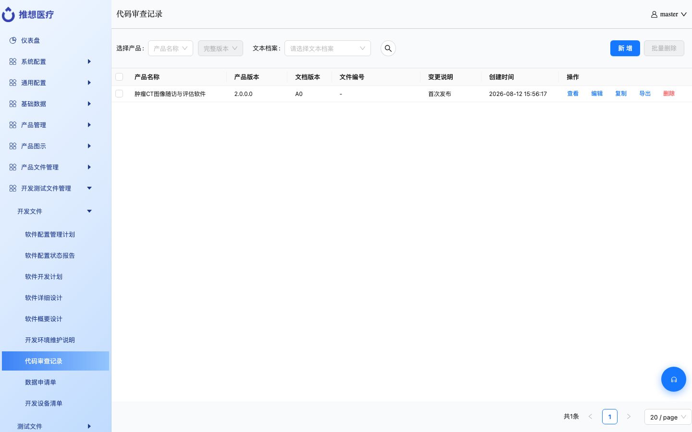

含检查表与审核签字。日期、被审核人、审核人、签字可从时间线 / 参与人员 / 人员签名自动获取。

#### 数据申请单

**概述**：申请开发或测试所需数据/设备资源的单据，以表格维护后导出 Word。

**入口**：开发测试文件管理 → 开发文件 → 数据申请单


设备清单表格编辑，导出 Word。

#### 开发设备清单

**概述**：维护开发用设备台账（名称、规格、资产编码等），供开发环境维护说明引用。

**入口**：开发测试文件管理 → 开发文件 → 开发设备清单

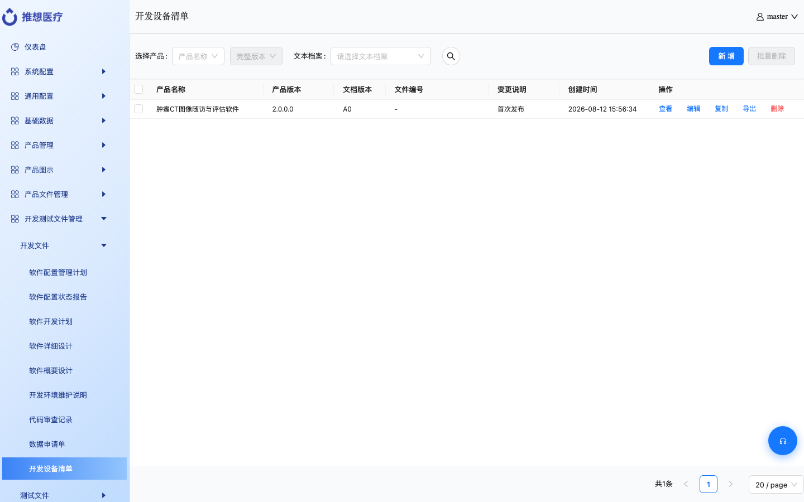

维护开发用设备台账，供开发环境维护说明引用，导出 Word。

### 9.2 测试文件

**概述**：集中管理测试计划、报告、用例、缺陷、现场测试和环境设备类文档，形成测试证据链。

#### 软件测试计划

**概述**：编写软件测试的范围、策略和安排，章节树编辑后导出 Word。

**入口**：开发测试文件管理 → 测试文件 → 软件测试计划


章节树编辑，导出 Word。

#### Bug 管理及回归测试

**概述**：上传缺陷 Excel 作为存档，系统按级别/状态做统计，供测试报告引用。不在系统内逐条手改缺陷。

**入口**：开发测试文件管理 → 测试文件 → Bug管理及回归测试

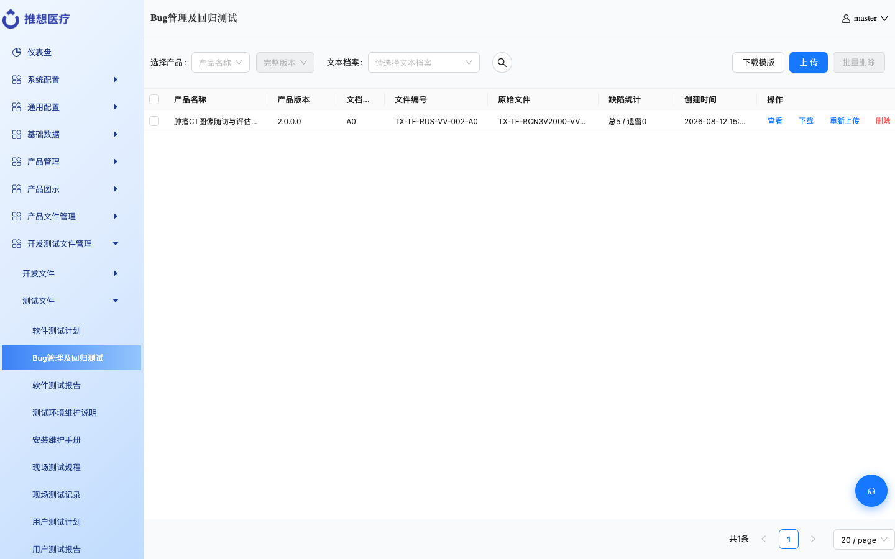

**支持功能**：上传 xlsx 缺陷表、预览按级别/状态统计、下载原文件、下载模板、编辑、删除。供软件测试报告引用。不支持在系统内逐条手改缺陷。

#### 软件测试报告

**概述**：汇总软件测试执行结果和结论，章节树编辑后导出 Word。

**入口**：开发测试文件管理 → 测试文件 → 软件测试报告

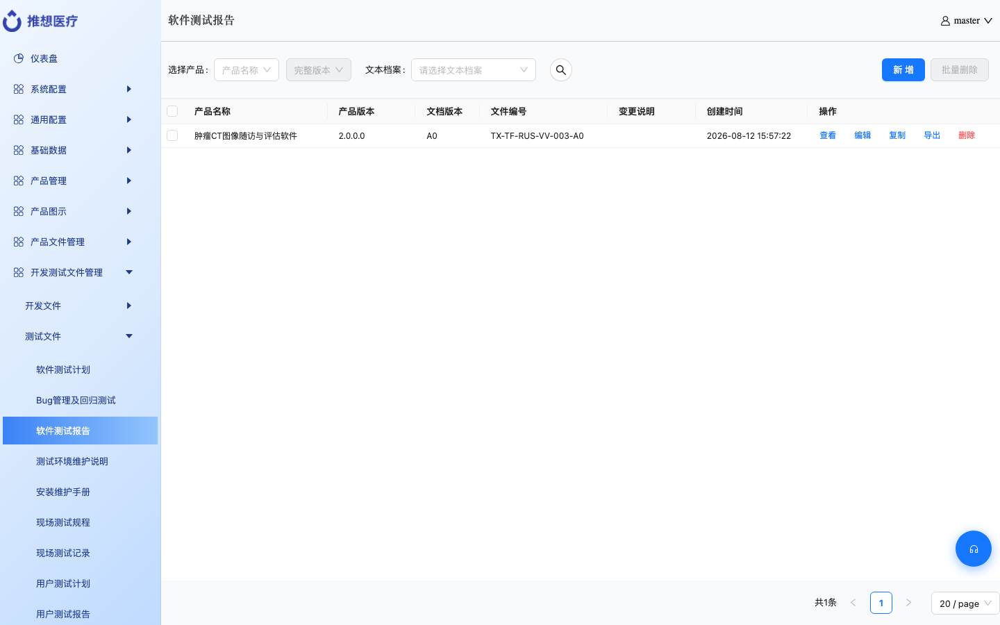

章节树编辑，导出 Word。

#### 测试环境维护说明

**概述**：说明测试环境如何检查和维护。资产来自测试设备清单，周检查表按「开始测试～测试结束」自动生成。

**入口**：开发测试文件管理 → 测试文件 → 测试环境维护说明


资产来自测试设备清单；周检查表按时间线「开始测试～测试结束」生成；导出横版 Word。

#### 安装维护手册

**概述**：编写软件安装与维护操作说明，可带 MD5 附件后导出 Word。

**入口**：开发测试文件管理 → 测试文件 → 安装维护手册


章节编辑，支持 MD5 附件，导出 Word。

#### 现场测试规程

**概述**：编写到现场执行测试时应遵循的步骤和判定准则。

**入口**：开发测试文件管理 → 测试文件 → 现场测试规程

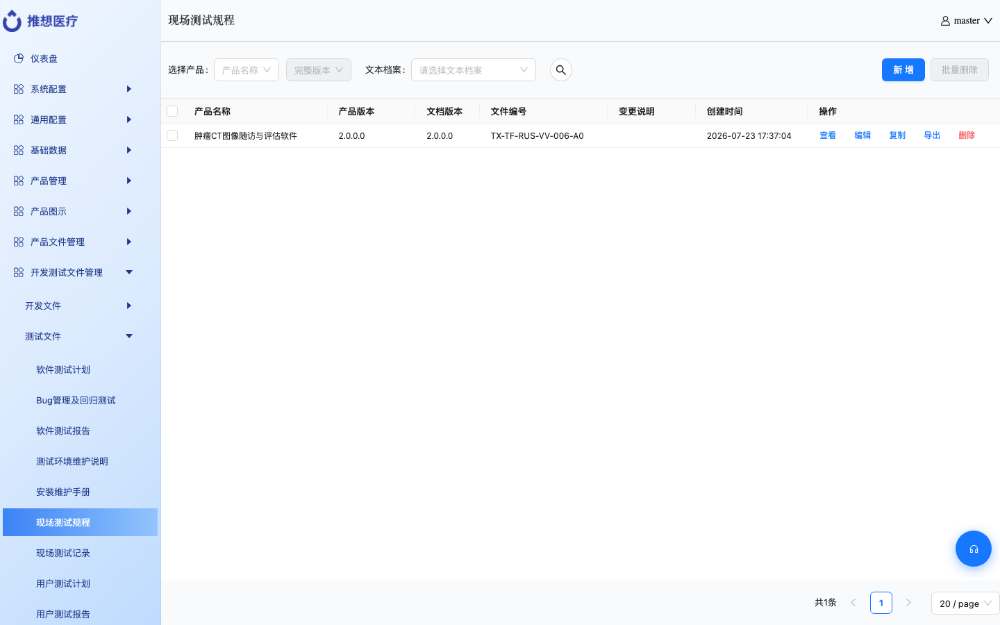

章节树编辑，部分内容自动填充，导出 Word。

#### 现场测试记录

**概述**：以大表格记录现场测试的实际结果，作为现场测试证据。

**入口**：开发测试文件管理 → 测试文件 → 现场测试记录

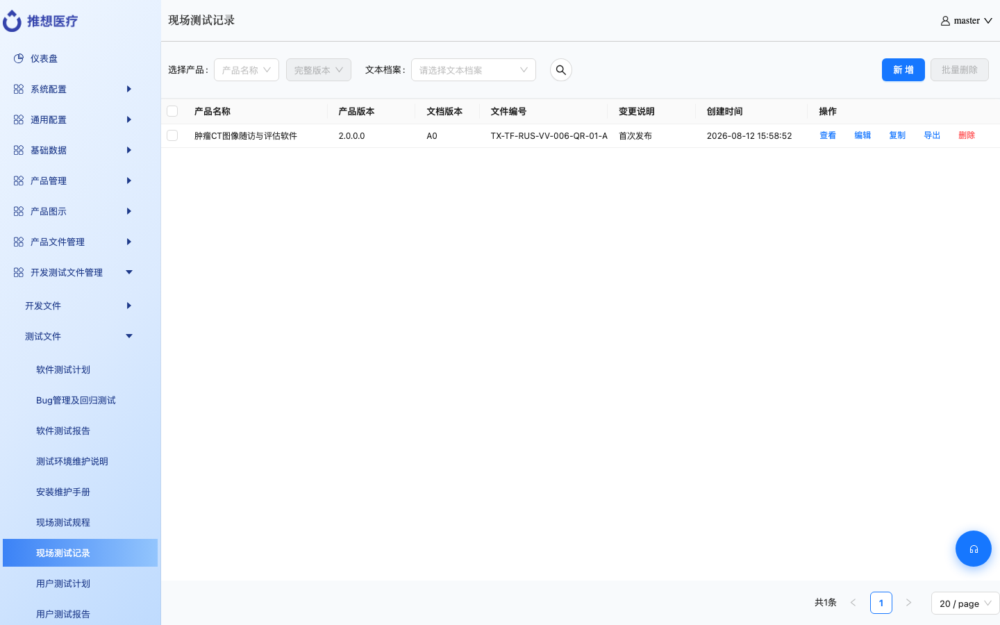

大表格编辑现场测试结果，导出 Word。

#### 用户测试计划

**概述**：编写由用户侧参与的测试计划。

**入口**：开发测试文件管理 → 测试文件 → 用户测试计划

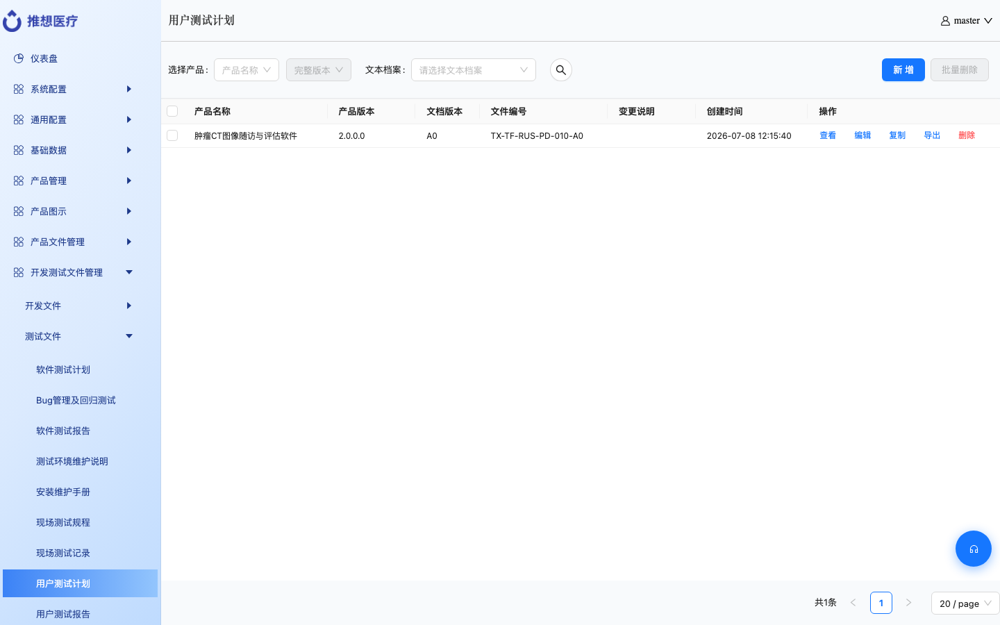

章节树编辑，导出 Word。

#### 用户测试报告

**概述**：汇总用户测试的执行情况和结论。

**入口**：开发测试文件管理 → 测试文件 → 用户测试报告

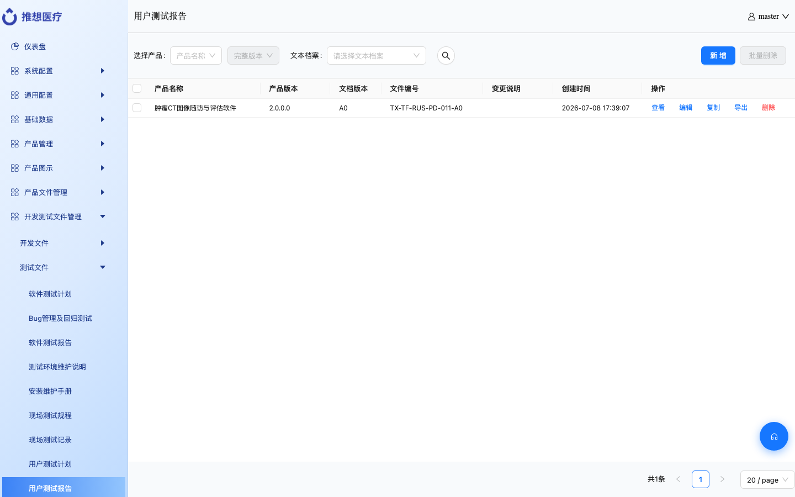

章节树编辑，导出 Word。

#### 测试设备清单

**概述**：维护测试用设备台账，供测试环境维护说明自动引用资产编码。

**入口**：开发测试文件管理 → 测试文件 → 测试设备清单

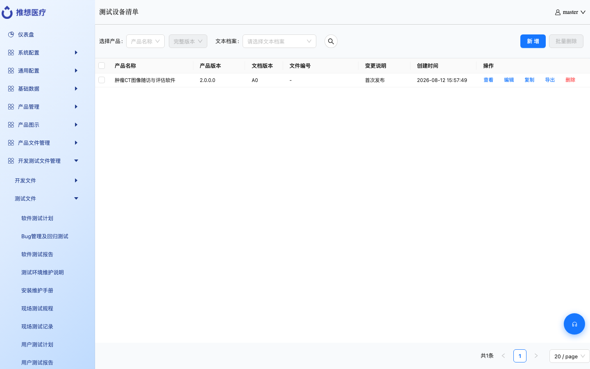

维护测试设备台账（名称、规格、资产编码、用途等），供测试环境维护说明引用，导出 Word。

#### 测试用例合集

**概述**：按产品+测试阶段用 Excel 批量导入测试用例（单元/集成/系统/用户）。系统不支持逐条手录；查看用例为只读。

**入口**：开发测试文件管理 → 测试文件 → 测试用例合集

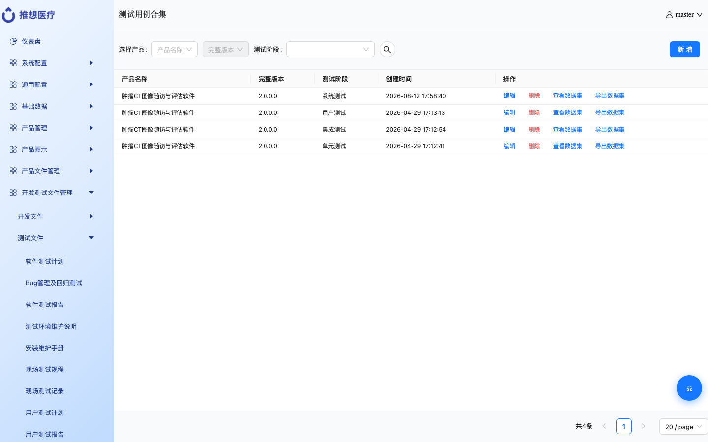

**支持功能**

- 按产品 + 阶段（单元 / 集成 / 系统 / 用户测试）管理测试集
- 新建 / 编辑时上传 Excel 批量导入用例（不支持逐条手录）
- 查看测试用例（只读表）、导出用例 Excel、删除（级联删除用例）
- 同一产品同一阶段只能有一个测试集
- 编辑时重传 Excel 会清空旧用例再导入

### 9.3 网络安全管理

**概述**：编写独立于通用风险管理的网络安全风险管理计划和报告，覆盖 STRIDE 威胁分析和网安控制措施。

#### 网络安全风险管理计划

**概述**：规划本产品网络安全风险如何识别、评估和控制，属于计划阶段文档。

**入口**：开发测试文件管理 → 网络安全管理 → 网络安全风险管理计划

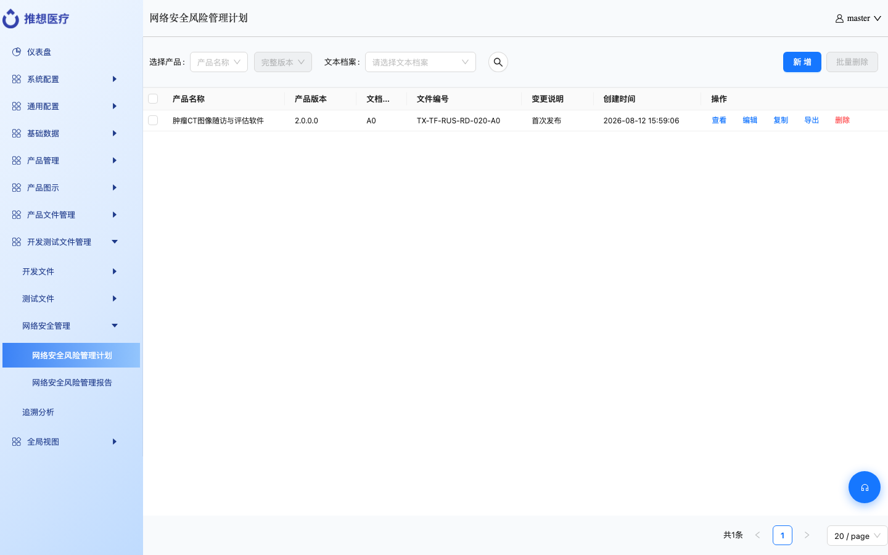

计划阶段文档：章节树、自动获取、导出 Word。

#### 网络安全风险管理报告

**概述**：输出网络安全风险评估结论，含威胁、控制措施和追溯，与「风险管理报告」分开维护。

**入口**：开发测试文件管理 → 网络安全管理 → 网络安全风险管理报告

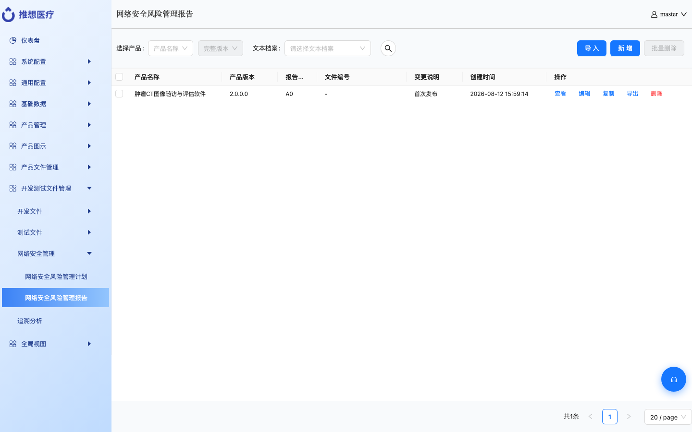

独立于通用风险管理报告。含 STRIDE 威胁、三类 RCM、追溯，导出 Word。

### 9.4 追溯分析

**概述**：按产品查看需求是否覆盖到详细设计、风险控制措施和各阶段测试用例，并可导出 Excel/Word，用于核对追溯完整性。

**入口**：开发测试文件管理 → 追溯分析

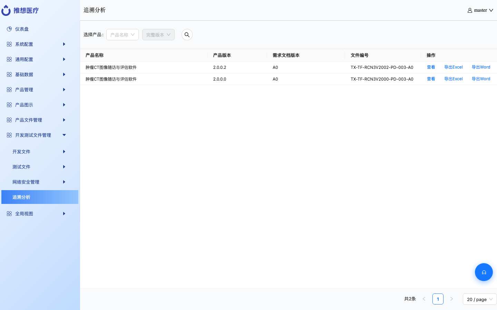

**支持功能**

- 按产品查看 SRS 追溯表（需求是否覆盖设计、RCM、各阶段测试）
- 查看详情
- 导出 Excel、导出 Word

追溯关系概览：

```
产品 → SRS 需求编号 → SDS 设计 / 产品 RCM / 测试用例
```

测试用例通过需求编号字符串关联，不是数据库外键。

---

## 10. 全局视图

**模块概述**：本模块做跨文档的汇总操作：对比两个 SRS/SDS 版本差异、按产品把已有文档打包成 zip 导出、把文档发到默认打印机。

### 10.1 文档内容比对

**概述**：选择两个 SRS 或 SDS 版本，对比产品信息和功能增删（按需求编号差集判断，仅改名不算增删）。

**入口**：全局视图 → 文档内容比对

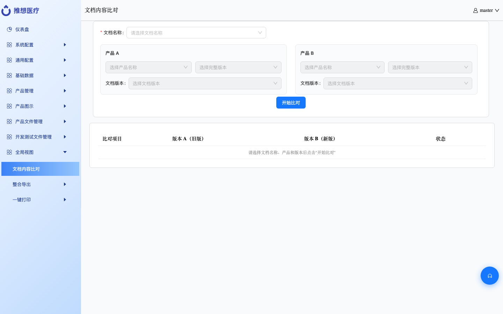

**支持功能**

- 选择文档类型（SRS 或 SDS）
- 左右各选一个产品 + 文档版本，点「开始对比」
- 对比产品信息、文档版本、功能增删（按需求编号差集；改名不计增删）
- 须选两个不同文档

### 10.2 整合导出

**概述**：按产品汇总已有的产品文件、开发文件、测试文件，勾选后打包成 zip 一次下载。

**入口**：全局视图 → 整合导出 → 整合导出

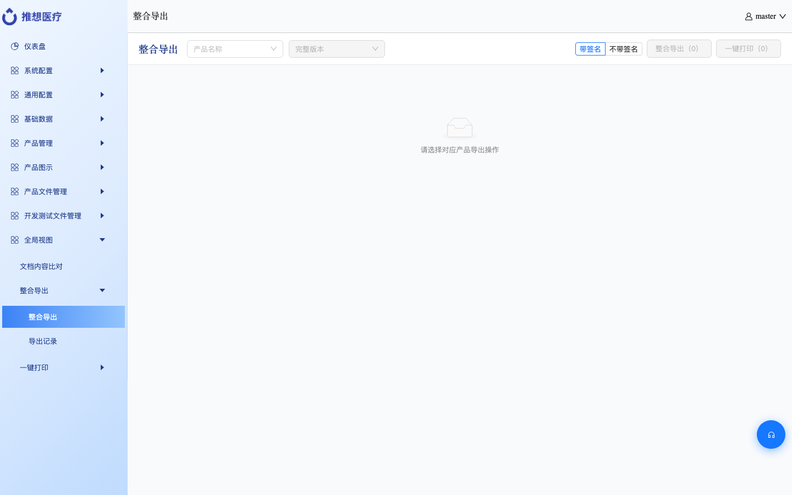

**支持功能**

- 选产品后按「产品文件 / 开发文件 / 测试文件」列出已有文档
- 勾选后批量导出为 zip（进度条）
- 未选产品则清单为空

### 10.3 导出记录

**概述**：查看历史上每一次整合导出的产品、文档数量、成功/失败数和操作人。

**入口**：全局视图 → 整合导出 → 导出记录

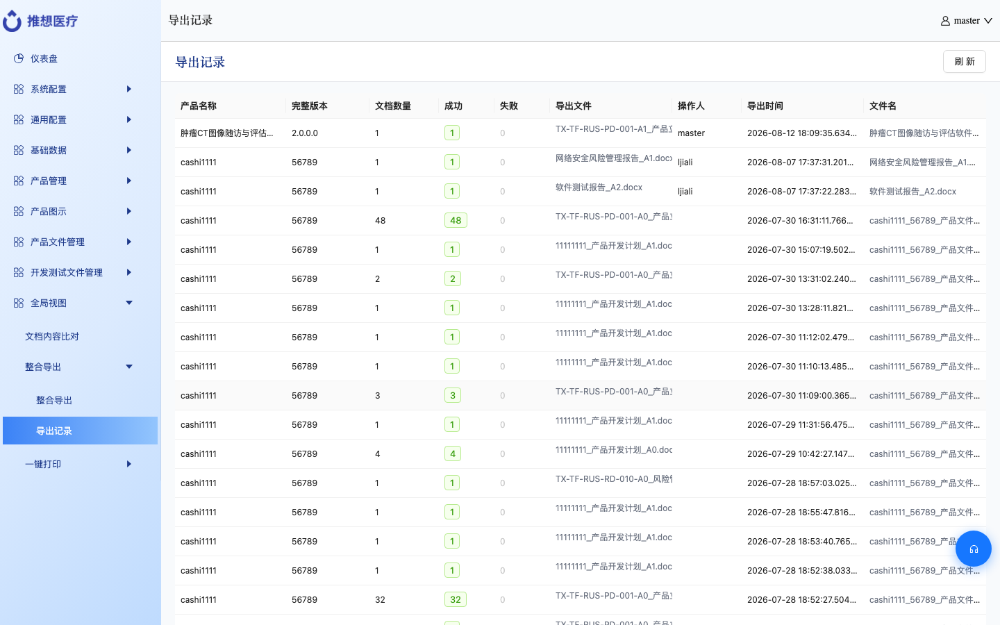

查看历史整合导出：产品、文档数量、成功/失败数、操作人、时间。

### 10.4 一键打印

**概述**：按产品勾选文档，生成 Word 并发送到「打印服务配置」中的默认打印机。

**入口**：全局视图 → 一键打印 → 一键打印

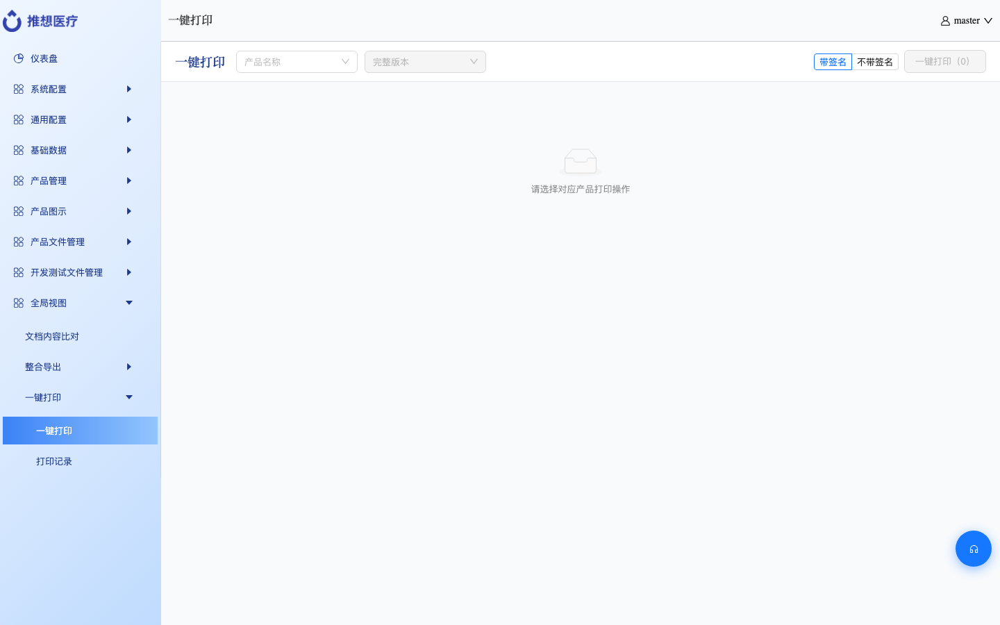

**支持功能**

- 选产品、勾选文档，发送到默认打印机
- 须先在「打印服务配置」中设置默认打印机

### 10.5 打印记录

**概述**：查看历史上每一次一键打印的数量、成功/失败情况和操作人。

**入口**：全局视图 → 一键打印 → 打印记录

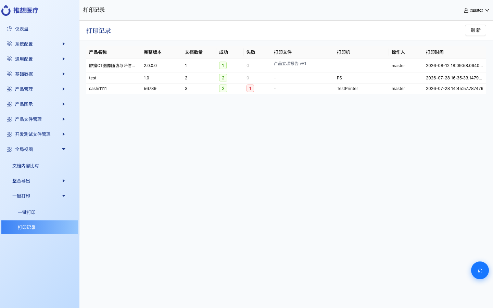

查看历史打印：产品、数量、成功/失败、操作人、时间。

### 10.6 AI 客服

**概述**：页面右下角助手。用自然语言询问功能入口和操作方法，系统按知识库检索回答。

页面右下角圆形按钮。输入问题后，按知识库检索返回相关说明；未命中时给出「猜你想问」建议。

---

## 11. 推荐操作主线

**模块概述**：下面给出从建账号到出文档的建议顺序。实际项目可按法规要求裁剪，但「先产品、再需求、再设计、再测试」这条主线一般不要颠倒。
建议按下面顺序使用系统：

1. **系统配置**：产品线 → 用户 / 角色  
2. **通用配置**：公司信息、人员签名、版本命名规则、打印机  
3. **产品管理**：新建产品版本 → 参与人员、时间逻辑线、运行环境、设备资源、DHF  
4. **基础数据 / 产品风险**：维护 HAZ、RCM、THREAT，并关联到产品  
5. **需求**：导入或新建 SRS，维护需求与变更表  
6. **设计**：绑定 SRS 新建或导入 SDS，做追溯同步  
7. **图示**：上传拓扑图、结构图等  
8. **测试**：导入测试用例合集，编写测试计划 / 报告 / 现场记录  
9. **其它注册文件**：立项、开发计划、风险报告等  
10. **全局视图**：追溯核对、文档比对、整合导出或一键打印  

---

## 附录：列表页按钮速查

| 按钮 | 常见含义 |
|------|----------|
| 新增 | 新建一条记录或一份文档 |
| 导入 | Word（.docx）或 Excel（.xlsx） |
| 导出 | Word / Excel / 图表下载 |
| 查看 | 只读打开 |
| 编辑 | 进入编辑 |
| 复制 | 生成新版本（产品复制还可勾选 DHF 联动） |
| 删除 | 删除当前行 |
| 批量删除 | 删除勾选行 |
| 刷新 | 重新加载列表 |
| 权限范围 | 配置角色可见菜单 |
| 重置密码 | 用户密码恢复为默认值 |
| 测试连接 / 设为默认 | 打印机 |

如需某模块的逐步字段说明与边界用例，可对照 `docs/function_docs/` 下 90–98 号用户手册。
